Immunichain Blockchain Lab
==========================

Before we get Started
=====================

Go to github.com/grice32/immunichain and download the contents. You will use these files throughout the lab. 

Part 1: Starting and Creating Your Hyperledger Composer Network
===============================================================

1. Go to your browser and go to https://composer-playground.mybluemix.net/

	Composer Playground works best in Chrome and even better in Incognito. 
	If you run it in Firefox, you cannot run it in a Private Window.
	I have always used Firefox without hiccups

2. You will get a Welcome pop-up box with a graphic and a few words. Click on Let’s Blockchain

.. image:: Images/25.png

3. Then you will be in the Composer Playground Homepage. Click on Deploy a Business Network.

.. image:: Images/26.png

4. Then create a name for you Blockchain Network. Give it a description as well. Then finish off by selecting empty-business-network. Once you have the information you want and have selected, click on deploy in the bottom right. 

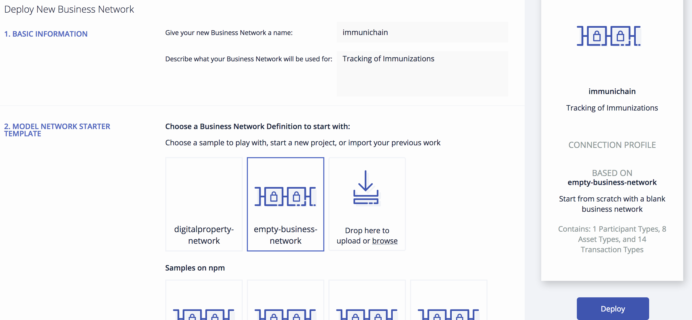

5. After this lab, you can play with some of the other sample business network applications, like animal tracking or vehicle lifecycles. 

6. You will then be taken to Your Wallet. Your wallet is basically a quick, seamless connection to multiple connections that you can jump around with. You will see later how easy it is. Click on Connect now in order to get connected to your Immunichain network.

.. image:: Images/28.png

7. Now you are in the Define section of the Composer Playground for Immunichain. Click on the +Add a File

.. image:: Images/29.png

8. Go to the directory where you saved the Github. Now drop in the .cto file. Click on Add once it has loaded. You will now do this for you .js and .acl files as well. 

.. image:: Images/30.png

9. After you have done that, your screen should look like this. If it does, click on each file and select Update.

.. image:: Images/31.png

**What did you just accomplish?**

You started you Hyperledger Composer Playground. At first you started with a blank business network, but then you added Immunichain files to your business network.

Part 2: Creating Assets and Participants
========================================

1. Now that you have an Immunichain Business Network, jump over to the Test section of the Composer Playground. The test area allows you to create assets, participants and submit transactions against your assets and participants. Your screen should look like this: 

Before we create assets and participants, we need to know what each asset and participants represent. 
	 - Guardian is obvious, but you are creating a parent
	 - MedProvider is simply a medical provider, like a doctor
	 - Member is who an organization who can view the health record
	 - Childform is simply the child

2. Now create a Medical Provider by clicking on the Medical Provider on the right and +Create New Participant in the top right. Give it Medical Provider serial number. I stick to 1, 2, 3 or low numbers that I can remember, but you can create any ID number you want. I suggest writing your ID numbers down as we move along. Once you have filled in the information click on Create.

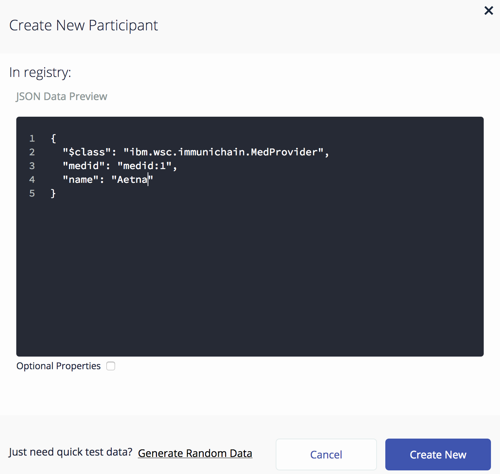

3. Once you have created a medical provider, your screen should look like this: 

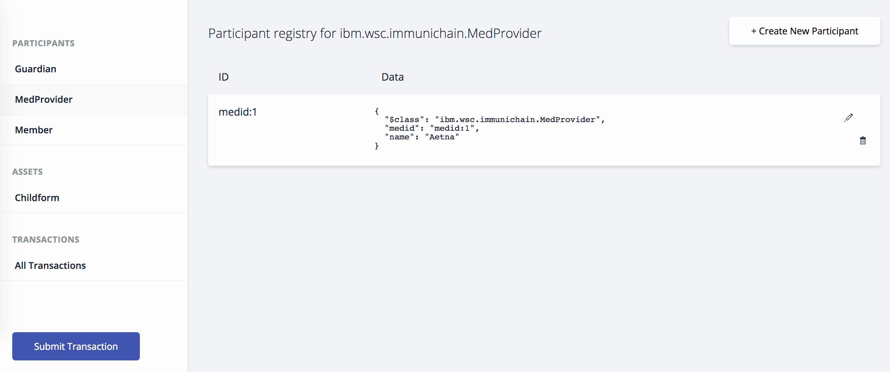

4. Now, go ahead and create a member as well.

.. image:: Images/34.png

5. Go ahead and make a guardian as well. Remember the guarding ID number you created. 

.. image:: Images/35.png

6. Now, let’s make a child. Click on optional properties at the bottom. Assign him to the guardian you just created a step ago. 

.. image:: Images/86.png

7. Your screen should look like this when you are done:

.. image:: Images/36.png

8. Go ahead and create more medical providers, members, guardians and children. Just to remember to write down the ID numbers. This will make more sense when we submit transactions. 

**What did you just accomplish?**

You created assets and participants within the Composer Playground. Additionally, I hope you also wrote down the various ID numbers. We are going to need them throughout the lab. 

Part 3: Creating and Switching to Different Identities
======================================================

A few weeks ago, Hyperledger Composer updated their service to version 0.12.0. It included a way to toggle between identities and Fabrics rapidly. This is really great to get the sense of how valuable Blockchain is. You will get an even better sense when we jump to the Immunichain website later on in the lab. 

1. So now you have created multiple guardians, medical providers, members and children. Now we are going to switch identities. From the test section of Composer click on Admin and then ID Registry found in the top right. 

.. image:: Images/37.png

2. If you did that successfully your screen should look like this: 

.. image:: Images/38.png

3. Now, click on + Issue New ID. A pop-up will come to the top and ask for an ID Name and Participant

4. Now, try creating a new identity (outside of Composer, I wouldn’t recommend trying to create a new identity) with the name of Aetna. For the participant just type in the number 1 or the ID Number you gave your participants and see what pops down.

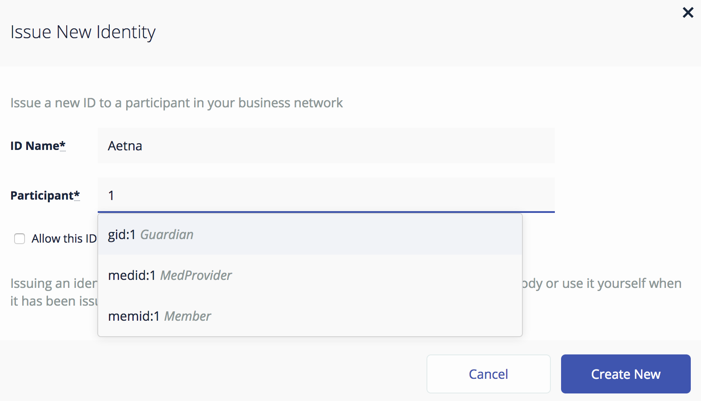

5. Click on Create New and you have now created a new identity

6. Then another pop-up will appear. For the most part, you can ignore the top portion of that pop-up. As far as the bottom part, click on + Add to my Wallet

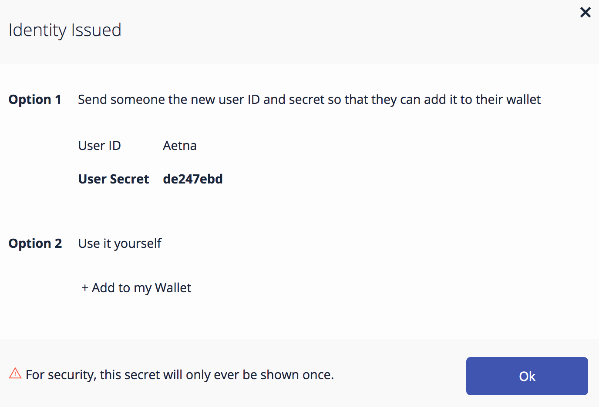

7. Once you have done that, this is what your screen will look like: 

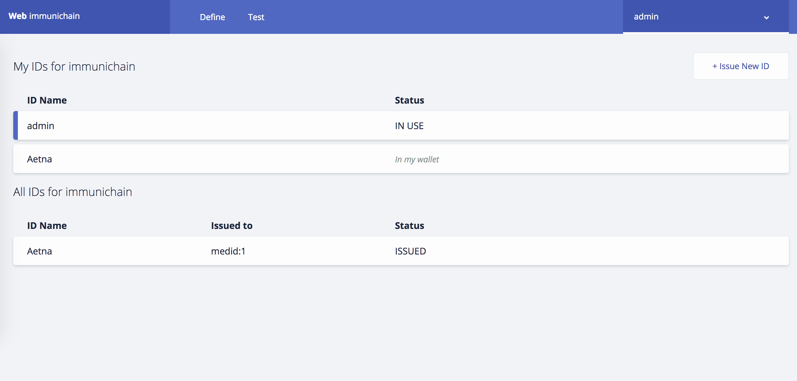

8. Create Identities for all of your participants. 

9. Once you have done that your screen will look like this:

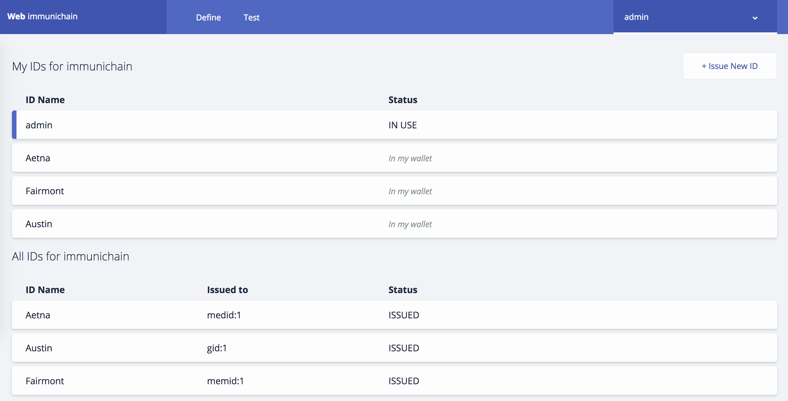

How many of you tried to create an identity of the child? Why do you think you were unable to create an identity for your child? 

One thing is that we have the Child as an asset and not a participant in the model file in Composer. More importantly, you wouldn’t want to have your child have access to change vital information - until you give them the authorization to do so. 

10. Alright, you have created several identities. How do we actually switch to them? I’m glad you asked. Click on admin in the top right and then click on Log Out.

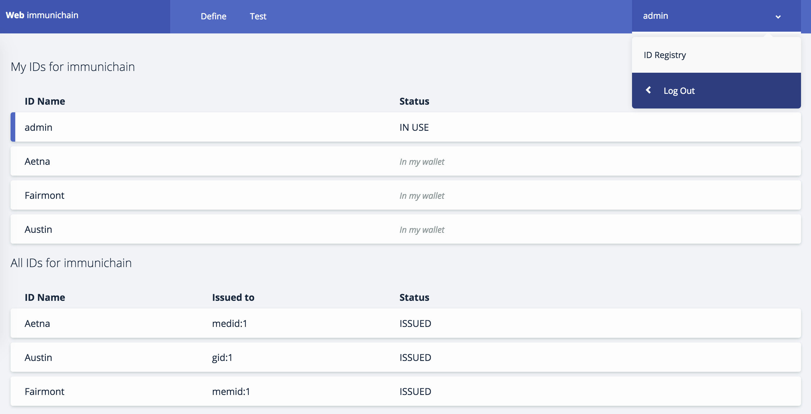

11. Now your screen will be filled with identities that you can connect to. 

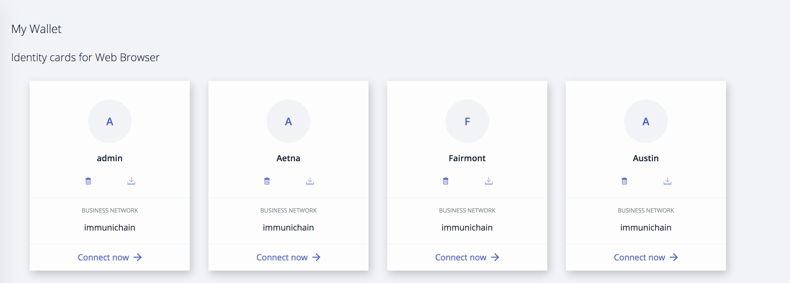

12. Try connecting to your various identities. Once you connect jump over to the Test section of Composer. Notice how the top right is now the name you gave your identity. 

.. image:: Images/45.png

13. Try creating a Member in the Test section of Composer

.. image:: Images/46.png

Why do you think you couldn’t successfully create a member? When designing this network, this type of authorization was what was agreed upon. In a real situation, you would discuss who can do what between all participants.

14. Jump back over to the admin identity. There we have authorization to create participants and submit transactions. 

**What did you just accomplish?**

You created various identities for the participants you have created in Composer. Then you created additional participants from those identities. For a good reason, you learned why you couldn’t do that.

Part 4: Submitting Transactions
===============================

1. Make sure you are connected back to the admin identity. You know by noticing the name in the top right of the screen. 

.. image:: Images/47.png

2. Click on Submit Transaction

3. A pop-up will appear with the transaction of assign a Medical Provider to one the children you’ve created

.. image:: Images/49.png

4. Now, replace the ID Numbers to replicate the guardian, medical provider and child. Look at the picture below to get a sense of what to do.

.. image:: Images/50.png

That basically says, assign medical provider #1 (Aetna) to Child #1 (SJ).

5. Click Submit once you have the ID Numbers you want.

6. Once you submit the transaction, it will take you to the Historian. Now is a good time to tell you about the Historian. The Historian is the sequence of transactions or addition or removal of participants or assets. I didn’t tell you to look at the Historian when you were creating the Participants, but the Historian kept track of when and what type of participant or asset you created. You can scroll to the bottom to view the first transaction you created, which should be the Medical Provider, Aetna or whatever you called it. You can see by clicking on view record. 

.. image:: Images/51.png

7. Back to our transaction, click on the Childform on the left. Find the child you assigned a Medical Provider to. Click on Show All to view the entire asset of that child. Notice the medical provider you assigned it to? 

.. image:: Images/52.png

8. Should we do another transaction? Of course! Click on Submit Transaction and let’s authorize a member to view the health record of our child. You can change the type of transaction you want by click on the middle grey box.

.. image:: Images/53.png

9. Now, let’s make an authorized member transaction. Here is my transaction. You can make any type of transaction you want here. 

.. image:: Images/54.png

My transaction says let member #1 (Fairmont High School Athletics) have Child #2’s (Emily) health record. This would be extremely useful when every year millions of kids get physicals in order to play a sport. Imagine having your medical provider authorize your child’s health record to approve them playing a sport. I know my parents would've enjoyed not dealing with both the High School and the Medical Provider.

10. You can view this transaction by clicking on childform on the right and then Show All on Emily. Notice that member #1 is now in Emily’s description. 

.. image:: Images/55.png

11. Let’s do another transaction. This time, let’s remove an authorized member that we just gave to Emily. Here is what my transaction looks like: 

.. image:: Images/56.png

12. Emily in the Childform section should look like this: 

.. image:: Images/57.png

13. We have submitted transactions, but now let’s actually add some immunizations to a child.

14. Click on Submit Transaction and then change the transaction type to addImmunizations. The format to add an immunization is a little different. In the Vaccine section put { "name" : "immunization", "provider" : "medical provider", "imdate" : "date" } inbetween the brackets. Replace the immunization, medical provider and date with whatever you would like. Here is what my transaction looks like: 

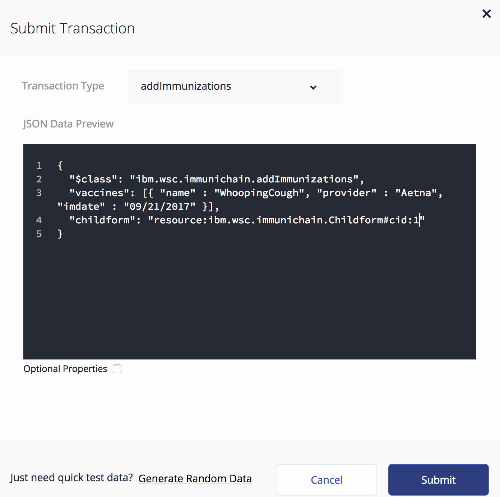

15. To view your immunization, go your child in the Childform section.

.. image:: Images/59.png

16. Continue to make various transactions that you want. 

**What did you just accomplish?**

You submitted transactions against participants within Composer. Hopefully, you now understand the value of authorizing members. Also, you added Immunizations to your child, which is the a pillar of Immunichain.

Part 5: Production Immunichain
==============================

1. Open up Google Chrome. Immunichain doesn’t work too well in Firefox. It does work in Firefox, but Google Chrome works the best. 

2. Go to https://immunichain.zcloud.marist.edu - Your screen should look like this: 

.. image:: Images/60.png

3. Click on Create an Account.

4. Enter the required information you need in order to create an account. I would write down your username and password. We will only create a Healthcare Provider this time.

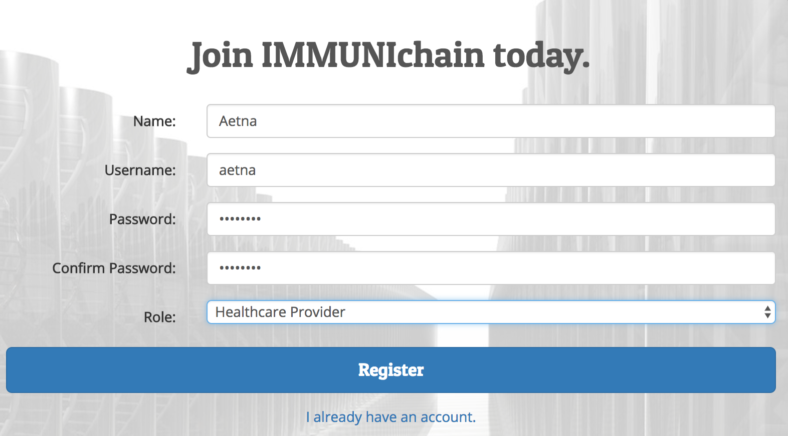

5. Your screen should look like this: 

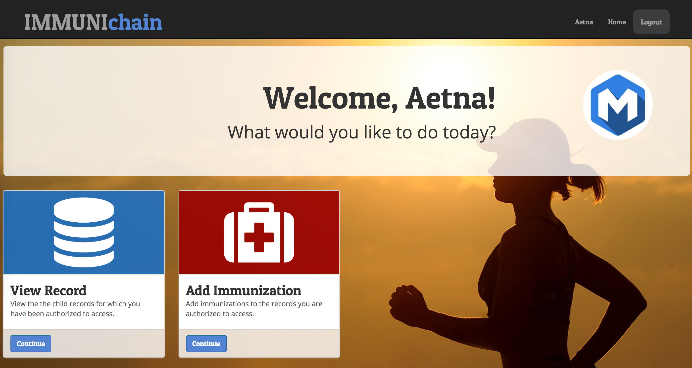

6. Log out of your participant by clicking on Logout button in the top right

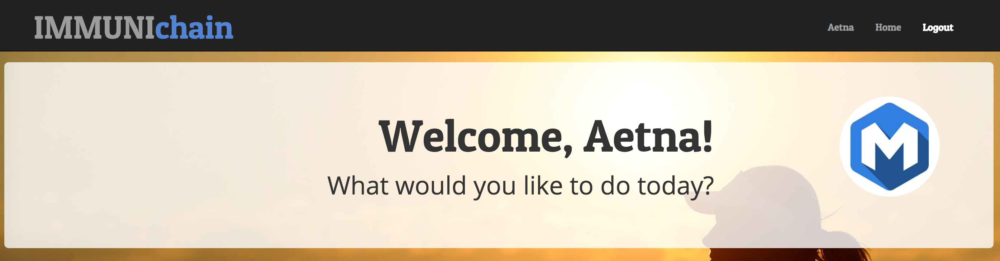

7. Create another account, but this time do a Member Organization. 

.. image:: Images/64.png

8. My screen looks like this. Notice how this member is only allowed to view the health record of the child? Why do you think that is so?

.. image:: Images/65.png

9. Log out of that participant. Create a few more Healthcare Providers and Member Organizations. 

10. Once you have a few more participants, let’s create a Guardian now. 

11. Adding a Guardian is similar to adding Member Organizations or Healthcare Providers. After creating a Guardian, this is what my screen looks like: 

.. image:: Images/66.png

12. Here we will Add a Child. This is found at the bottom of the page. 

.. image:: Images/67.png

13. Now fill in the information required. Go ahead and assign Healthcare Providers and Member Organizations to your child. Because there are a lot of people doing this lab, there will be a lot of various Healthcare Providers and Member Organizations to choose from. Only select the Healthcare Providers and Member Organizations that you have personally created. Click on Submit when you are done. 

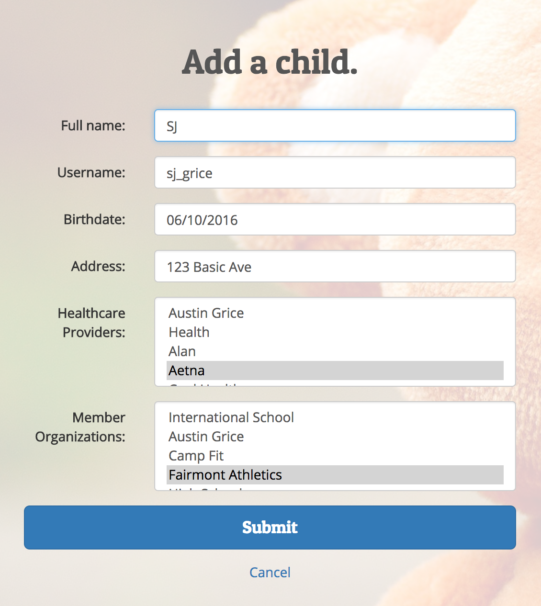

14. If you get the Success! page, click on Logout in the top right. 

.. image:: Images/69.png

15. Once you are on the homepage, log into the Healthcare provider you assign to your child. 

16. Once you are in the home page of the Healthcare Provider, click on Continue of Add Immunization.

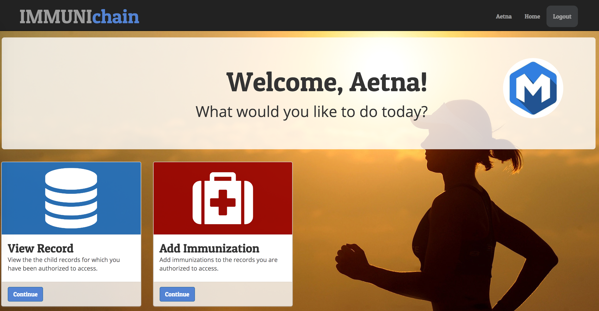

17. Select the child in the drop down

.. image:: Images/71.png

18. Then add an immunization and the date you added the immunization. Once you have added the information you want, click on Submit. 

.. image:: Images/72.png

19. You will get the Success! page once again. Logout and log in as the Member Organization you assigned to your child. 

.. image:: Images/73.png

20. Then click on Continue of the View Record. 

21. Now, click on the child you created.

.. image:: Images/74.png

22. This is the view that this member has on your child. The Member cannot edit the information. They can only view the health record that they have authorization to. 

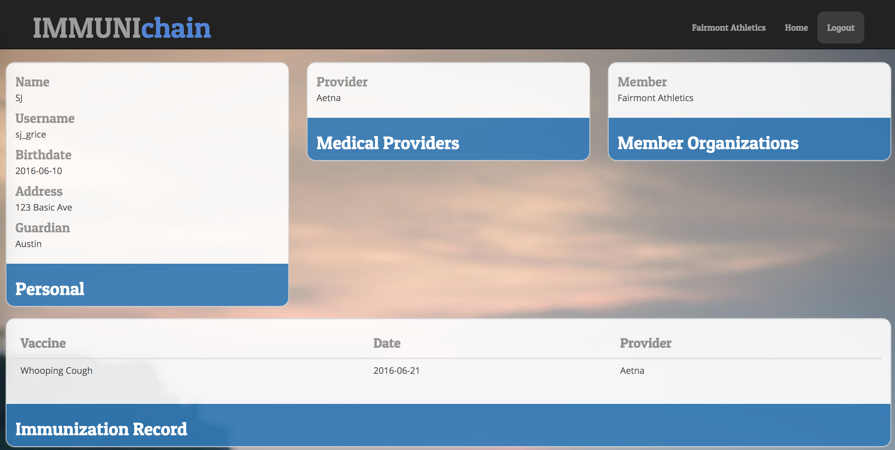

23. Continue to make various accounts and updating your children that you create. 

**What did you just accomplish?**

You went to the Immunichain website and create various accounts. You added Member Organizations, Healthcare Providers, Guardians and Children. Then you then added immunizations from the Healthcare Provider account to the child. Then you viewed the health record of the Child from the Member's perspective. 

End of Lab!
===========

