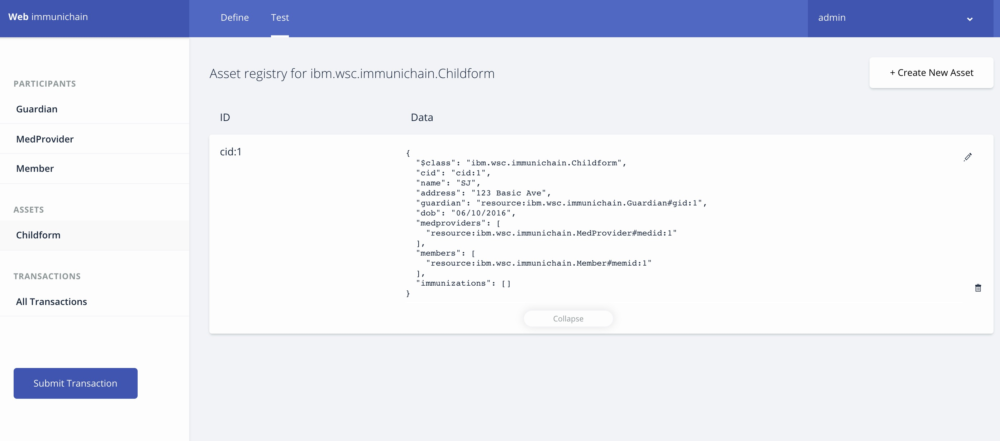
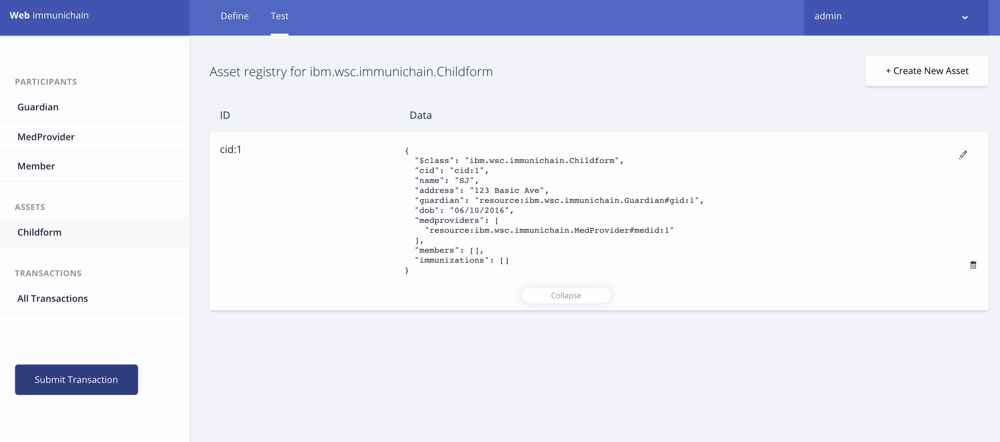

IMMUNIChain Blockchain Lab
==========================

Introduction
============

Welcome to the IMMUNIChain Blockchain Lab. This lab showcases the power of Blockchain through the tracking of Immunizations through Medical Providers, Guardians and selected Members. The IMMUNIChain came from an internal IBM Blockchain Hackathon back in May. Around this time, an Open Mainframe Project intern Kevin Lee from University of Illinois at Urbana-Champaign was tasked to make a website demonstrating the benefits of Blockchain of this use case. In early August, Kevin showcased his end product, which you will get to work with today. 

What are you going to accomplish today? The Hyperledger Composer Playground is way to produce Blockchain applications quickly without the heavy technical knowledge. We will be using the Cloud Composer Playground. We will create our Blockchain application with a .bna file (banana file) that will make up the IMMUNIChain. We will then create assets and participants. After that, we will submit transactions and see how the participants look after those transactions. Toward the end of the lab portion, we will use the IMMUNIChain website to examine how Blockchain can be useful in tracking immunizations between medical providers, selected members and guardians.

Table of Contents
	- Part 1: Starting and Creating Your Hyperledger Composer Network
	- Part 2: Creating Assets and Participants
	- Part 3: Submitting Transactions
	- Part 4: Production IMMUNIChain
	
Prerequisites
	- Access to the internet
	- Web Browser (Google Chrome)
	- No prior knowledger of Hyperledger Composer or Blockchain required

Part 1: Starting and Creating Your Hyperledger Composer Network
===============================================================

Go to ``github.com/grice32/immunichain`` and download the content by clicking on the green button on the right. Depending on your system (Mac or Windows), there will be a pop-up asking you to save the download in a folder. Select a folder that you will remember. 

1. Go to your browser and go to ``https://composer-playground.mybluemix.net/``

	Composer Playground works best in Chrome and even better in Incognito Mode. 
	If you run it in Firefox, you cannot run it in a Private Window.
	I have always used Firefox, without any hiccups.

2. You will get a Welcome pop-up box with a graphic and a few words. Click on **Let’s Blockchain**

.. image:: Images/25.png

3. Then you will be in the Composer Playground Homepage. Click on **Deploy a Business Network**

.. image:: Images/26.png

4. Then create a name for your Blockchain Network of ``immunichain``. Give it a description as well. Then finish off by **selecting browse in the Model Network Starter**  

.. image:: Images/100.png

5. That will pop-up a file folder. Go to the folder where you downloaded the github contents. Then **select the immunichain.bna** file

.. image:: Images/101.png

6. Next, click on **Deploy** that is located on the bottom right 

.. image:: Images/102.png

7. You will then be taken to Your Wallet. Your wallet is basically a quick, seamless connection to multiple connections that you can jump around with. Click on **Connect Now** in order to get connected to your IMMUNIChain network

.. image:: Images/28.png

8. After you have done that, your screen should look like this **after clicking on Model File** on the left. The Model File is where you define the participants, assets, and transactions in your business network.  Feel free to scroll through this file to see the definitions related to IMMUNIChain

.. image:: Images/31.png

**What did you just accomplish?**

You started you the Hyperledger Composer Playground. At first you started with a blank business network, but then you added IMMUNIChain banana file to your business network.

Part 2: Creating Assets and Participants
========================================

1. Now that you have an IMMUNIChain Business Network, **jump over to the Test section** of the Composer Playground. The test area allows you to create assets, participants and submit transactions against your assets and participants. Your screen should look like this: 

.. image:: Images/99.png

Before we create assets and participants, we need to know what each asset and participant represent 
	 - Guardian is, simply, a parent
	 - MedProvider is a medical provider, such as a hospital, medical practice or doctor
	 - Member is an organization that can only view the health record, such as a camp or high school athletics
	 - Childform is a child

2. Now create a Medical Provider by clicking on the **MedProvider** on the left and **+Create New Participant** in the top right. Give it Medical Provider ID number of 1. Once you have filled in the information click on **Create**

::

 {
  "$class": "ibm.wsc.immunichain.MedProvider",
  "medid": "medid:1",
  "name": "HealthQuest"
 }

.. image:: Images/103.png

3. Once you have created a medical provider, your screen should look like this: 

.. image:: Images/104.png

4. Now, **click on Member on the left and create a member as well by clicking on Create New Participant.** You can give it an ID number of 1 as well

::

 {
  "$class": "ibm.wsc.immunichain.Member",
  "memid": "memid:1",
  "name": "Fairmont High School Athletics"
 }

.. image:: Images/34.png

5. Go ahead and **click on Guardian on the left and create a guardian by clicking on Create New Participant.** Give the guardian an ID number of 1 as well

::

 {
  "$class": "ibm.wsc.immunichain.Guardian",
  "gid": "gid:1",
  "name": "Austin"
 }

.. image:: Images/35.png

6. Now, let’s make a child by **clicking on Childform on the left and then clicking on Create New Asset. Click on optional properties at the bottom first.** Then assign him to the guardian you just created a step ago. **Leave the medprovider, members, and immunizations empty** 

::

 {
  "$class": "ibm.wsc.immunichain.Childform",
  "cid": "cid:1",
  "name": "SJ",
  "address": "123 Basic Ave",
  "guardian": "resource:ibm.wsc.immunichain.Guardian#gid:1",
  "dob": "06/10/2016",
  "medproviders": [],
  "members": [],
  "immunizations": []
 }

.. image:: Images/86.png

7. Your screen should look like this when you are done:

.. image:: Images/36.png

8. You can jump to part 3 if you are finished, but if you want to you can create more medical providers, members, guardians and children. Just remember to write down the ID numbers. This will make more sense when we submit transactions. 

**What did you just accomplish?**

You created assets and participants within the Composer Playground. 

Part 3: Submitting Transactions
===============================

Now that you have created participants and assets, you can now manipulate the asset by submitting transactions.

1. Make sure you are connected to the admin identity. You will know that by noticing the name in the top right portion of the screen 

.. image:: Images/47.png

2. **Click on Submit Transaction** found in the bottom left

3. A pop-up will appear with the transaction to assign a Medical Provider to one of the children you’ve created

.. image:: Images/49.png

4. Now, **replace the ID Numbers** to replicate the guardian, medical provider and child that were created in part 2. Look at the picture below to get a sense of what to do

::

 {
  "$class": "ibm.wsc.immunichain.assignMedProvider",
  "guardian": "resource:ibm.wsc.immunichain.Guardian#gid:1",
  "medprovider": "resource:ibm.wsc.immunichain.MedProvider#medid:1",
  "childform": "resource:ibm.wsc.immunichain.Childform#cid:1"
 }

.. image:: Images/50.png

That basically says, assign medical provider #1 to Child #1. You are authorizing Medical Provider #1 to be able to add immunizations to Child #1

5. **Click Submit** once you have the ID Numbers you want

6. Once you submit the transaction, it will take you to the Historian. Now is a good time to tell you about the Historian. The Historian is a specialised registry which records successful transactions, including the participants and identities that submitted them. I didn’t tell you to look at the Historian when you were creating the Participants, but the Historian kept track of when and what type of participant or asset you created. You can scroll to the bottom to view the first transaction you created, which should be the Medical Provider you created. You can see by clicking on view record. 

.. image:: Images/51.png

7. Back to our authorized member transaction, **click on the Childform** on the left. Find the child you assigned a Medical Provider to. **Click on Show All** to view the entire asset of that child. Notice the medical provider you assigned to the child

.. image:: Images/52.png

8. Should we do another transaction? Of course! **Click on Submit Transaction** and let’s authorize a member to view the health record of our child. You can change the type of transaction you want by clicking on the middle grey box

.. image:: Images/53.png

9. Now, let’s make an authorized member transaction.

::

 {
  "$class": "ibm.wsc.immunichain.authMember",
  "guardian": "resource:ibm.wsc.immunichain.Guardian#gid:1",
  "member": "resource:ibm.wsc.immunichain.Member#memid:1",
  "childform": "resource:ibm.wsc.immunichain.Childform#cid:1"
 }

My transaction says let member #1 have a read only copy of Child #1’s health record. This would be extremely useful when every year millions of kids get physicals in order to play a sport. Imagine having the guardian authorize their child’s health record to a member organization (High School Athletics) to approve them playing a sport. I know my parents would've enjoyed not dealing with both, the High School and the Medical Provider, to just play a sport. Also, because it is read only, the member wouldn't be able to change any information. 

10. You can view this transaction by **clicking on childform** on the left and then **Show All** on your child. Notice that member #1 is now in the child’s description

11. Let’s do another transaction. This time, let’s remove an authorized member that we just gave to your child. Here is what my transaction looks like

::

 {
  "$class": "ibm.wsc.immunichain.removeMemberAuth",
  "guardian": "resource:ibm.wsc.immunichain.Guardian#gid:1",
  "member": "resource:ibm.wsc.immunichain.Member#memid:1",
  "childform": "resource:ibm.wsc.immunichain.Childform#cid:1"
 }

12. Your child in the Childform section should look like this. Notice that member #1 has been removed from the members section of the Childform

13. We have submitted transactions, but now let’s actually add some immunizations to a child

14. **Click on Submit Transaction** and then change the transaction type to addImmunizations. The format to add an immunization is a little different. In the Vaccine section copy **{ "name" : "immunization", "provider" : "medical provider", "imdate" : "date" }** inbetween the brackets []. **Replace the immunization, medical provider and date with whatever you would like.** Here is what my transaction looks like

::

 {
  "$class": "ibm.wsc.immunichain.addImmunizations",
  "vaccines": [{ "name" : "WhoopingCough", "provider" : "HealthQuest", "imdate" : "09/21/2017" }],
  "childform": "resource:ibm.wsc.immunichain.Childform#cid:1"
 }

.. image:: Images/105.png

15. To view your immunization, **go your child in the Childform section.** In the immunizations section of their record, you should see the immunization that you just added

.. image:: Images/106.png

16. You can now jump to Part 4, but if you want to continue you can make various transactions that you want 

**What did you just accomplish?**

You submitted transactions against participants within Composer. You now understand the value of authorizing members. Also, you added Immunizations to your child, which is the pillar of Immunichain.

Part 4: Production Immunichain
==============================

1. Open up Google Chrome. IMMUNIChain doesn’t work too well in Firefox. It does work in Firefox, but Google Chrome works the best

2. Go to ``https://immunichain.zcloud.marist.edu`` - Your screen should look like this: 

.. image:: Images/60.png

3. **Click on Create an Account**

4. **Enter the required information** you need in order to create an account. I would write down your username and password. We will only create a Healthcare Provider this time

.. image:: Images/107.png

5. Your screen should look like this: 

.. image:: Images/108.png

6. Log out of your participant by **clicking on Logout** button in the top right

.. image:: Images/109.png

7. **Create another account,** but this time do a **Member Organization**

.. image:: Images/64.png

8. My screen looks like this. Notice how this member is only allowed to view the health record of the child? Why do you think that is so?

.. image:: Images/65.png

9. Log out of that participant. **Create a few more Healthcare Providers and Member Organizations**

10. Once you have a few more participants, let’s **create a Guardian now** 

11. Adding a Guardian is similar to adding Member Organizations or Healthcare Providers. After creating a Guardian, this is what my screen looks like: 

.. image:: Images/66.png

12. Here we will **Add a Child.** This is found at the bottom of the page 

.. image:: Images/67.png

13. Now fill in the information required. Go ahead and assign Healthcare Providers and Member Organizations to your child. Because there are a lot of people doing this lab, there will be a lot of various Healthcare Providers and Member Organizations to choose from. **Only select the Healthcare Providers and Member Organizations that you have personally created. Click on Submit** when you are done 

.. image:: Images/110.png

14. If you get the Success! page, **click on Logout** in the top right

.. image:: Images/69.png

15. Once you are on the homepage, **log into the Healthcare provider** you assigned to your child

16. Once you are in the home page of the Healthcare Provider, **click on Continue of Add Immunization**

.. image:: Images/108.png

17. Select the child in the drop down

.. image:: Images/71.png

18. Then **add an immunization** and the date you added the immunization. Once you have added the information you want, **click on Submit**

.. image:: Images/72.png

19. You will get the Success! page once again. **Logout and log in as the Member Organization you assigned to your child** 

.. image:: Images/73.png

20. Then **click on Continue of the View Record**

21. Now, **click on the child you created**

.. image:: Images/74.png

22. This is the view that this member has on your child. The Member cannot edit the information. They can only view the health record that they have authorization to

.. image:: Images/111.png

23. Continue to make various accounts and updating your children that you create

**What did you just accomplish?**

You went to the IMMUNIChain website and create various accounts. You added Member Organizations, Healthcare Providers, Guardians and Children. Then you then added immunizations from the Healthcare Provider account to the child. Then you viewed the health record of the Child from the Member's perspective. 

End of Lab!
===========
