Immunichain Blockchain Lab
==========================

Introduction
============

Welcome to the Immunichain Blockchain Lab. This lab showcases the power of Blockchain through the tracking of Immunizations through Medical Providers, Guardians and selected Members. The Immunichain came from an internal IBM Blockchain Hackathon back in May. Around this time, an Open Mainframe Project intern Kevin Lee from University of Illinois at Urbana-Champaign was tasked to make a website demonstrating the benefits of Blockchain of this use case. In early August, Kevin showcased his end product, which you will get to work with today. 

What are you going to accomplish today? The Hyperledger Composer Playground is way to produce Blockchain applications quickly without the heavy technical knowledge. We will be using the Cloud Composer Playground. We will create our Blockchain application with a .bna file (banana file) that will make up the Immunichain. We will then create assets and participants. After that, we will submit transactions and see how the participants look after those transactions. Toward the end of the lab portion, we will use the Immunichain website to examine how Blockchain can be useful in tracking immunizations between medical providers, selected members and guardians.

Table of Contents
	- Part 1: Setting Up Your LinuxONE Community Cloud Account
	- Part 2: Getting Your Linux Guest Ready for Composer Playground
	- Part 3: Starting and Creating Your Hyperledger Composer Network
	- Part 4: Creating Assets and Participants
	- Part 5: Creating and Switching to Different Identities
	- Part 6: Submitting Transactions
	- Part 7: Production Immunichain
	- Part 8: Connecting Composer to a Fabric
	- Part 9: Connecting Your Immunichain Fabric to a REST Server
	
Prerequisites
	- Access to the internet
	- Web Browser (Google Chrome)
	- No prior knowledger of Hyperledger Composer or Blockchain required
	
	
	

Part 1: Setting Up Your LinuxONE Community Cloud Account
========================================================

1.  From your browser, **go to https://developer.ibm.com/linuxone/**

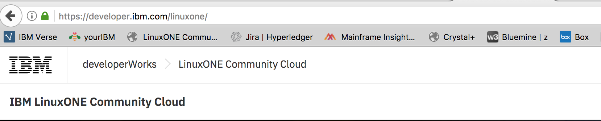

2. **Click on Start your trial now**

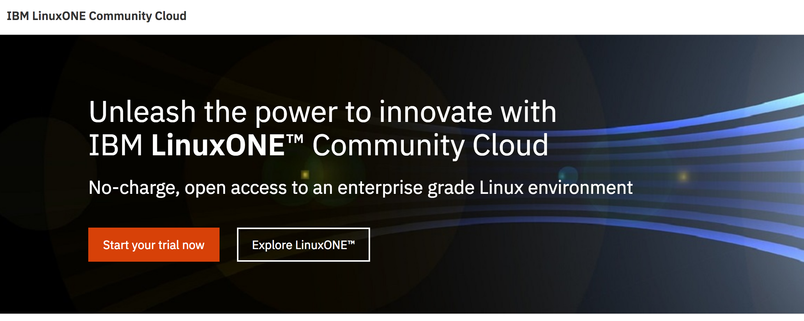

3. Complete the **required fields, once filled in click on Request your trial**

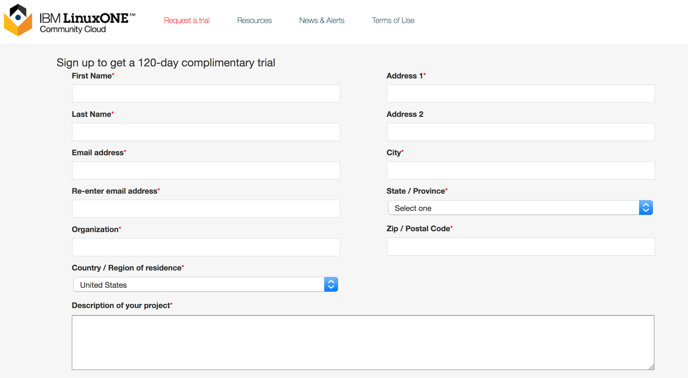

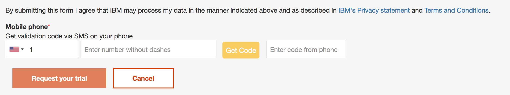

4. You will receive an email containing your User ID and password. **Follow the link to the LinuxONE CC**

.. image:: Images/5.png

5. You’ll be the website asking you for your User ID and Password. **Enter your credentials and click on Sign in**

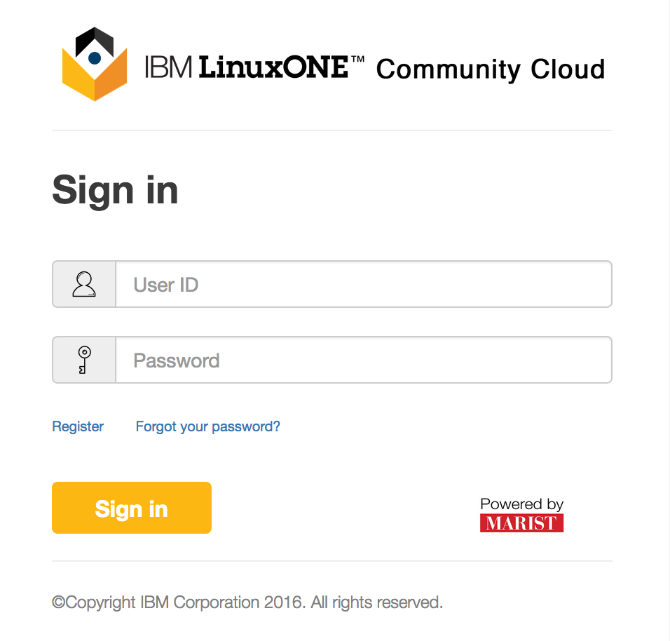

6. You’ll now be on the LinuxONE CC Home Page. **Click on the Manage Instances under the Infrastructure section**

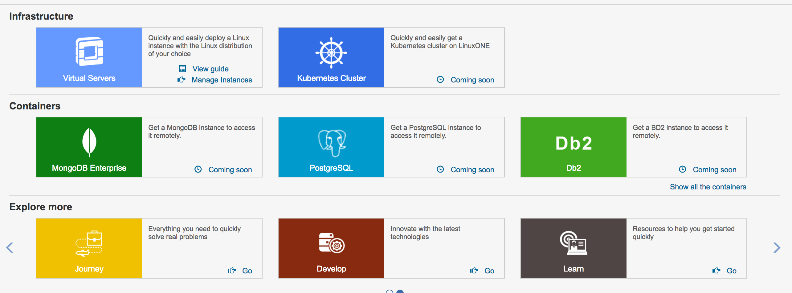

7. Click on Create

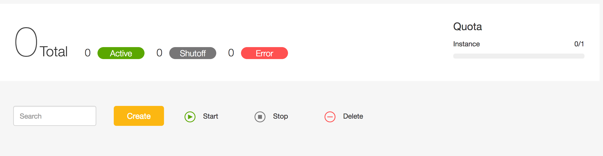

8. Enter the correct information:
	
	- Type: General Purpose VM
	- Instance Name: Immunichain
	- Instance Description: (whatever you might like)
 	- Image: SLES12 SP2
	- Flavor: LinuxONE-Medium
	
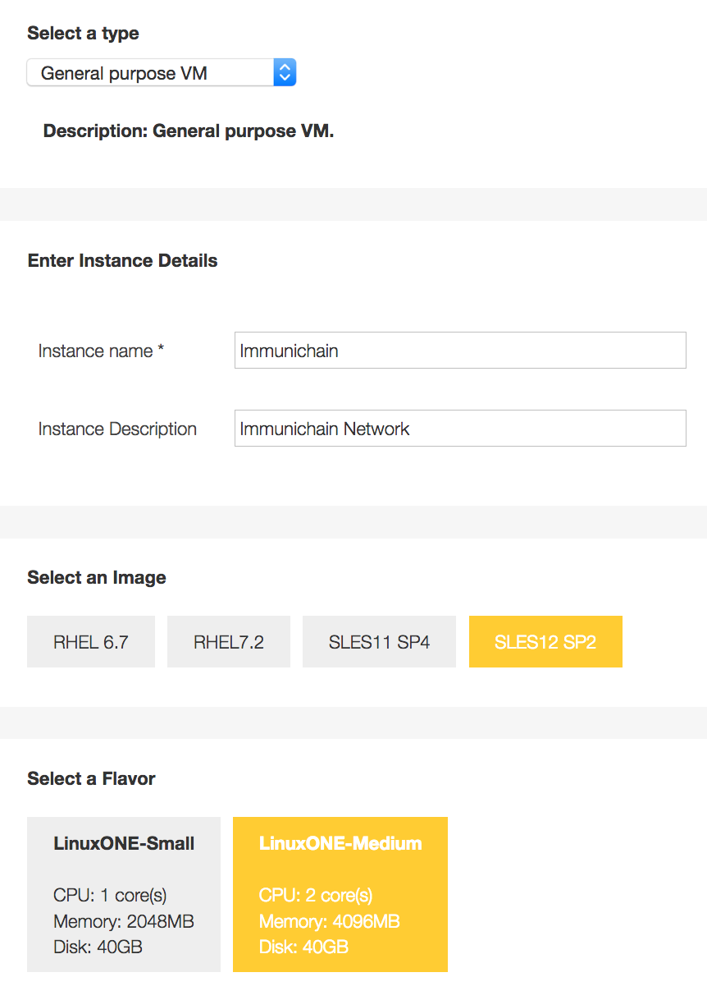

9. Under the SSH Key Pair section, **click on Create**

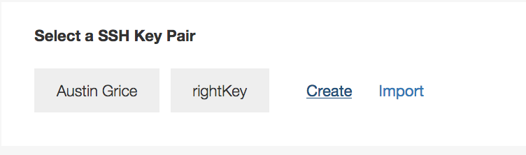

10. In the pop-up box, **enter a name you would like to give your keys. Then click on Create a new key pair**

.. image:: Images/11.png

11. You will then be prompted to save the fille (keys). **Click on Save File.** If you didn’t get prompted, it might of automatically download to your folders

.. image:: Images/12.png

12. Back on the LinuxONE CC, **select your new keys in the SSH Key Pair section**

.. image:: Images/13.png

13. Review all the selections you selected and **click on Create**

.. image:: Images/14.png

14. You will see the Instance starting up. Once it says ACTIVE in the status column, note your IP Address. It might be best to write down your IP Address. You can always toggle between your terminal and the LinuxONE CC website. 

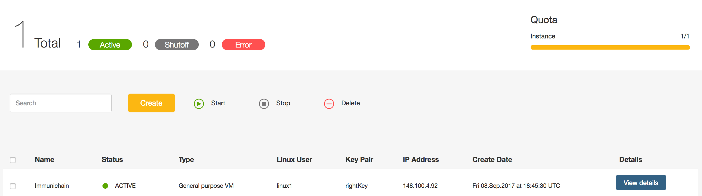

15. You can just **ssh linux1@xxx.xxx.x.xx** to connect to your Linux guest. If it works, jump to step 21. If that doesn’t work jump to the next step

16. From your terminal, **navigate to where you downloaded your keys**

17. Modify the permissions of your private key by entering **cmod 600 keyname.pem**
	
	keyname refers to what you named your keys

20. From the path where your keys are located enter **ssh –i keyname.pem linux1@xxx.xxx.x.xx** 

	xxx.xxx.x.xx refers to your LinuxONE CC IP Address

21. **Type yes** when you are prompted to continue connecting to your instance

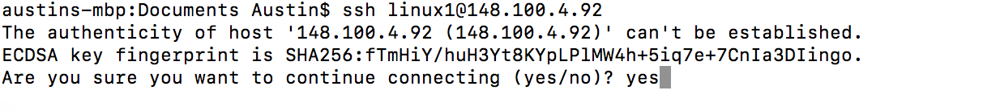

22. You are now connected to your LinuxONE CC instance! 

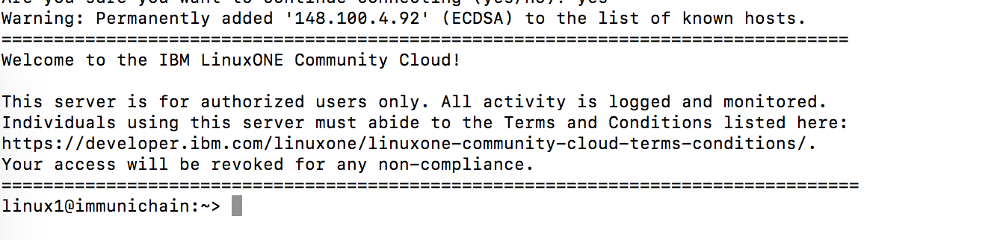

Why stop now, we are just now having fun! Continue to the next part. 

**What you just accomplished:**

You created and got into your LinuxONE CC instance. Also, you generated new keys. Don’t ask me about my terrible key experience. No, I didn’t lose millions in Bitcoin. Anyways, you just set yourself up for success for the rest of the lab. 

Part 2: Getting Your Linux Guest Ready for Composer Playground
==============================================================

The previous part got you ready for Hyperledger Playground from the perspective of creating your LinuxONE CC Instance. This part will now get you ready from the perspective of your active Linux guest. Don’t worry, this part is extremely short!

1. Run this command **git clone https://github.com/grice32/immunichain** from within your Linux guest

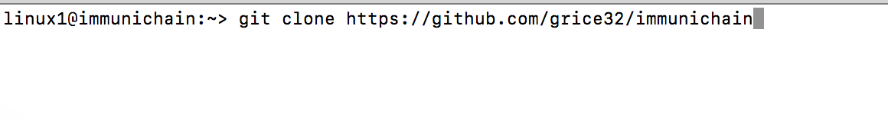

2. **Change directories to immunichain by cd immunichain/ then enter ls** to confirm that there is a Linux1BlockchainScript.sh file there

.. image:: Images/19.png

3. Make the file executable by entering **chmod u+x Linux1BlockchainScript.sh**

4. **Enter ls** again to see the file again

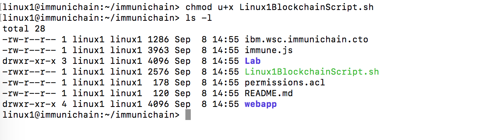

5. Copy the Linux1BlockchainScript.sh from the immunichain directory to your home/linux1 directory **cp Linux1BlockchainScript.sh /home/linux1/**

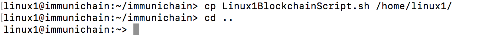

6. Return back one directory **cd ..** and enter **df –h** if you do not see “/data” in the mounted column, wait a few moments before going onto the next step

7. Once you have /data, run the file by entering **./Linux1BlockchainScript.sh** – Be patient, this script will take 7 to 10 minutes to run. If it doesn’t want to run, you might need to exit out of your Linux guest and sign back in. 

.. image:: Images/22.png

8. The first time you run the script you will need to exit in order for some permissions and environment variables to take effect. You can do this by entering exit once you get your command line back

9. While you are exited from you Linux guest, clone the same git from above **git clone https://github.com/grice32/immunichain** - You will use certain files later on in the lab

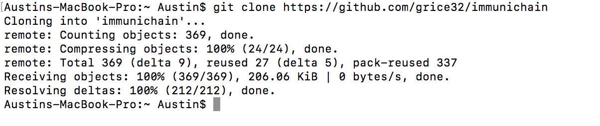

10. Now you can log back into your Linux guest by either entering **ssh linux1@xxx.xxx.x.xx** or **ssh –i keyname.pem linux1@xxx.xxx.x.xx** - If you do the second option, you have to be within your directory where you saved your keys

	The xxx.xxx.x.xx refer to your LinuxONE CC OP Address
	The keyname.pem refers to the name you gave your keys

11. Now, verify that you have a running Hyperledger Fabric and Composer network by entering **docker ps –a**

12. Also, verify that you have Composer Playground running by entering **ps -ef|grep playground**

Congratulations if you just did all of this successfully. You just did the hard part. In next section we will start with the Immunichain 

**What you just accomplished:**

You cloned a github repository in order to get the required files needed. Then you ran the Linux1BlockchainScript.sh script in order to download more required software, like Hyperledger Composer and the REST server. You then verified that you had a running Hyperledger Fabric and Composer Playground by checking your Docker images.

Part 3: Starting and Creating Your Hyperledger Composer Network
===============================================================

1. Still in your terminal enter **composer-playground** to start up the Composer Playground

2. Go to your browser and enter your LinuxONE IP Address with port 8080 at the end **xxx.xxx.x.xx:8080**

	Composer Playground works best in Chrome and even better in Incognito 
	If you run it in Firefox, you cannot run it in a Private Window
	I have always used Firefox without hiccups.
	
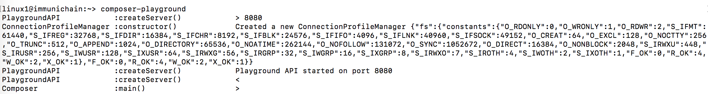

2. You will get a Welcome pop-up box with a graphic and a few words. Click on **Let’s Blockchain**

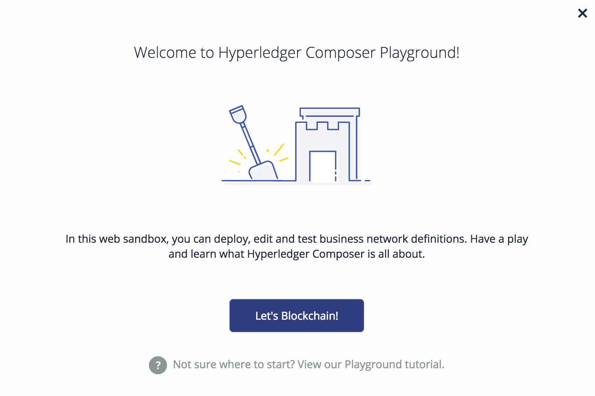

3. Then you will be in the **Composer Playground Homepage.** Click on **Deploy a Business Network.**

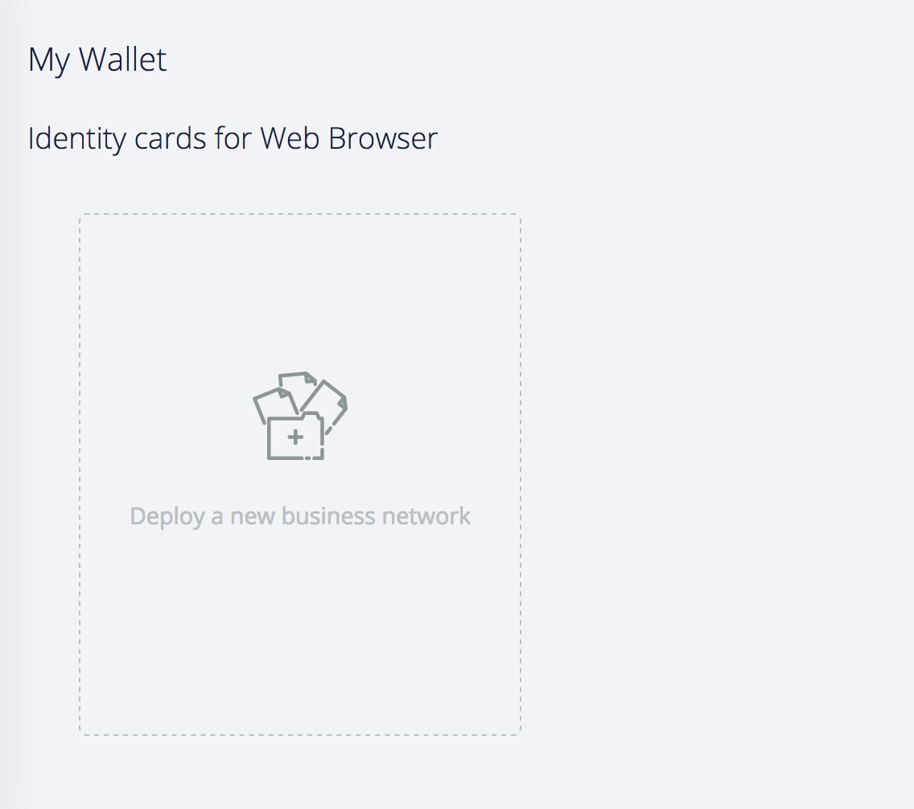

4. Then create a name for your Blockchain Network. Give it a description as well. Then finish off by selecting **empty-business-network.** Once you have the information you want and have selected, click on **deploy** in the bottom right. 

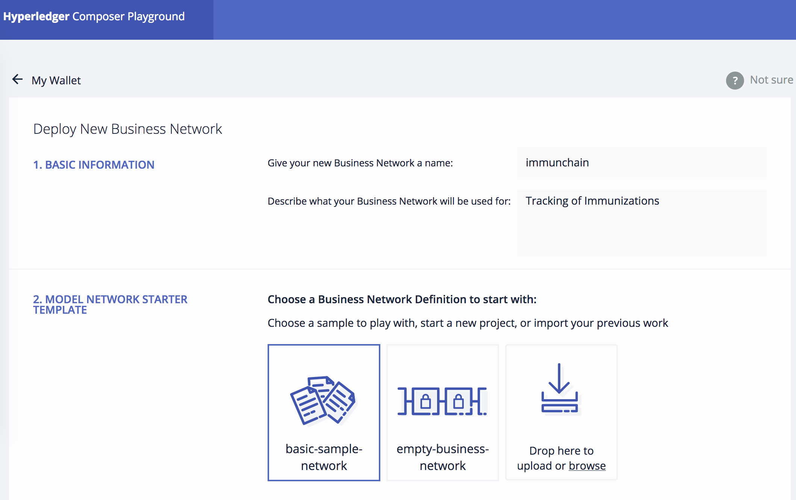

5. After this lab, you can play with some of the other sample business network applications, like animal tracking or vehicle lifecycles. 

6. You will then be taken to Your Wallet. Your wallet is basically a quick, seamless connection to multiple connections that you can jump around with. You will see later how easy it is. Click on **Connect now** in order to get connected to your Immunichain network.

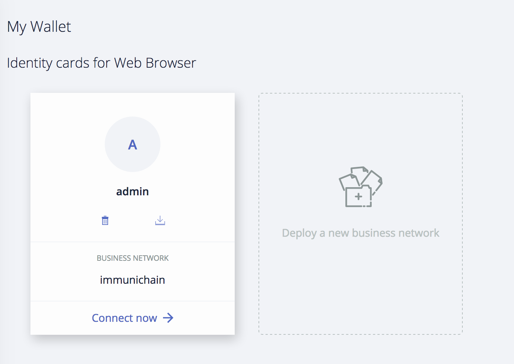

7. Now you are in the Define section of the Composer Playground for Immunichain. Click on the **+Add a File**

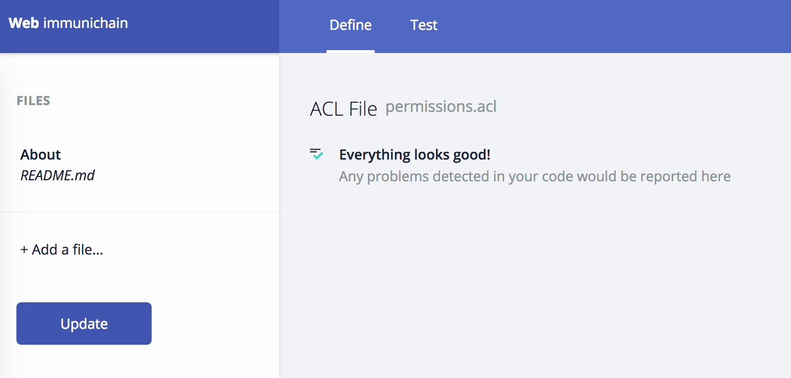

8. Go to the directory where you saved the Github. Now drop in the **.cto file.** Click on Add once it has loaded. You will now do this for your **.js and .acl files** as well. 

.. image:: Images/30.png

9. After you have done that, your screen should look like this. If it does, click on each file and select Update.

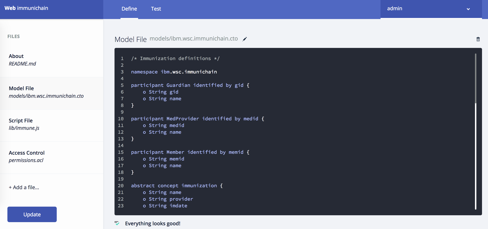

**What did you just accomplish?**

You started you Hyperledger Composer Playground. At first you started with a blank business network, but then you added Immunichain files to your business network.

Part 4: Creating Assets and Participants
========================================

1. Now that you have an Immunichain Business Network, jump over to the **Test section** of the Composer Playground. The test area allows you to create assets, participants and submit transactions against your assets and participants. 

Before we create assets and participants, we need to know what each asset and participants represent. 
	 - Guardian is obvious, but you are creating a parent
	 - MedProvider is simply a medical provider, like a doctor
	 - Member is who an organization who can view the health record
	 - Childform is simply the child

2. Now **create a Medical Provider** by clicking on the Medical Provider on the right and **+Create New Participant** in the top right. Give it Medical Provider serial number. Stick to **medid:1 or medid:2**

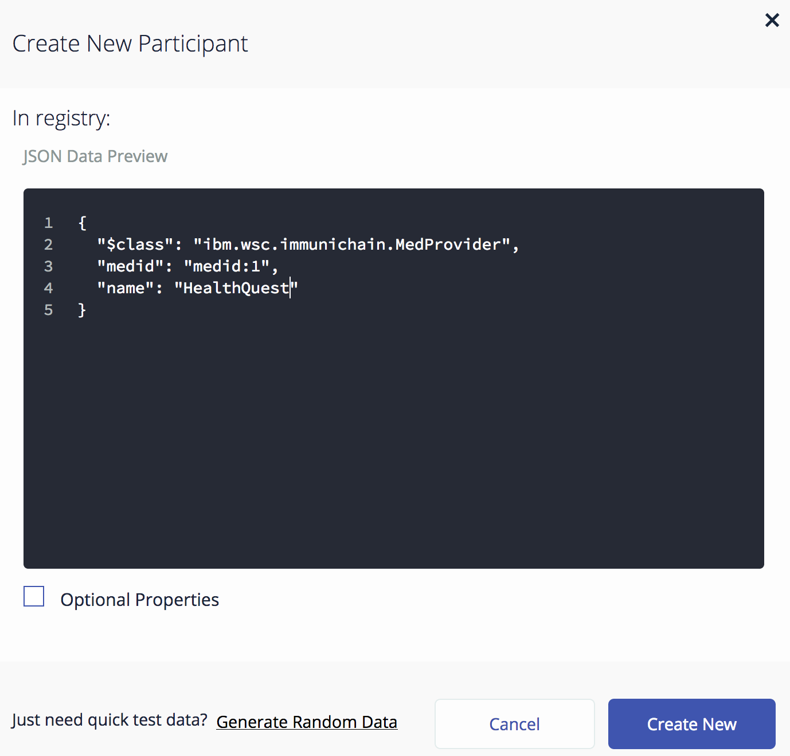

3. Once you have created a medical provider, your screen should look like this: 

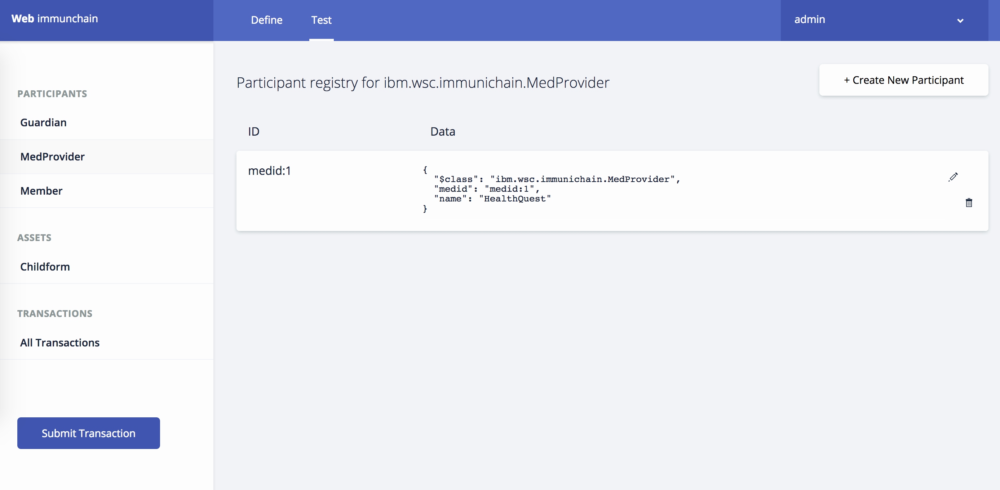

4. Now, go ahead and **create a member** as well.

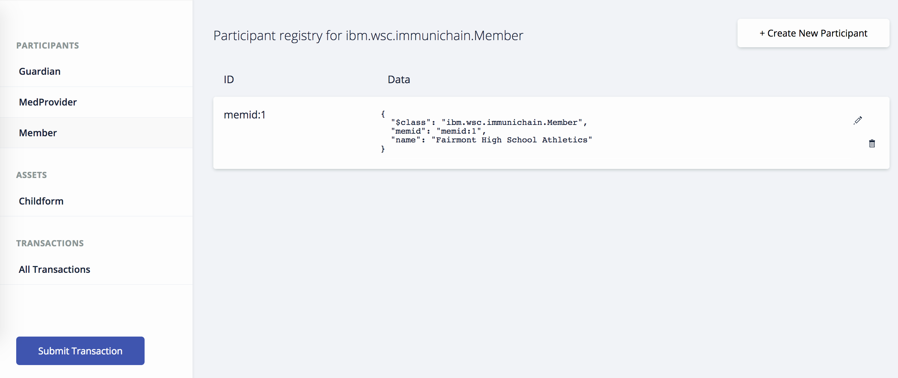

5. Go ahead and **make a guardian** as well. Remember the guardian ID number you created. 

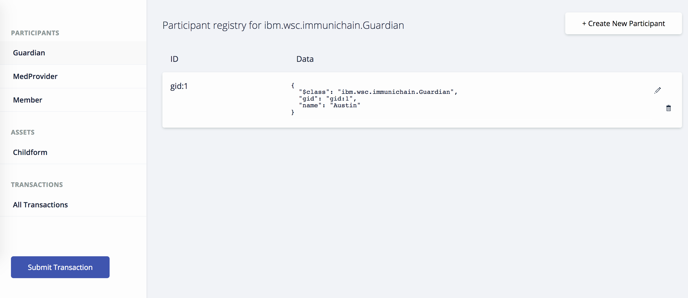

6. Now, let’s make a child. **Click on optional properties** at the bottom. Assign him to the guardian you just created a step ago. 

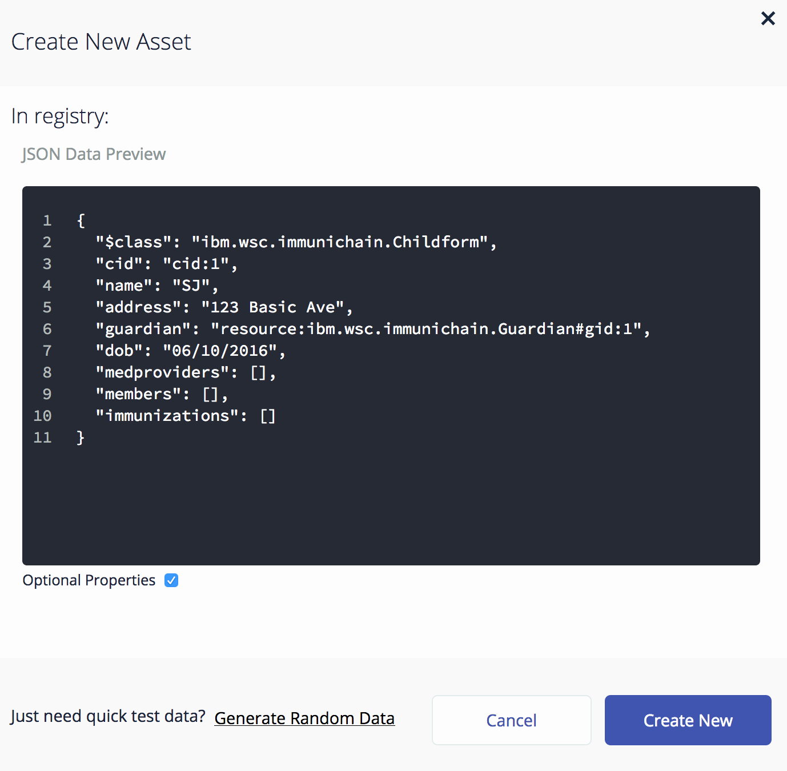

7. Your screen should look like this when you are done:

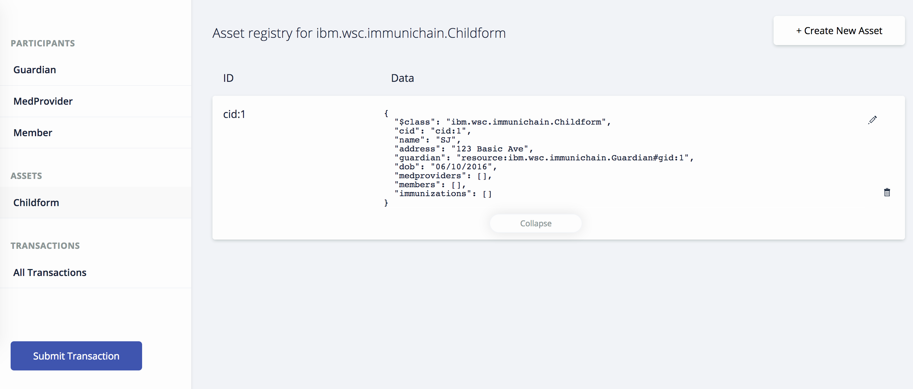

8. Go ahead and **create more medical providers, members, guardians and children.** Just to remember to write down the ID numbers. This will make more sense when we submit transactions. 

**What did you just accomplish?**

You created assets and participants within the Composer Playground. Additionally, I hope you also wrote down the various ID numbers. We are going to need them throughout the lab. 

Part 5: Creating and Switching to Different Identities
======================================================

A few weeks ago, Hyperledger Composer updated their service to version 0.12.0. It included a way to toggle between identities and Fabrics rapidly. This is really great to get the sense of how valuable Blockchain is. You will get an even better sense when we jump to the Immunichain website later on in the lab. 

1. So now you have created multiple guardians, medical providers, members and children. Now we are going to **switch identities.** From the test section of Composer **click on Admin and then ID Registry found in the top right** 

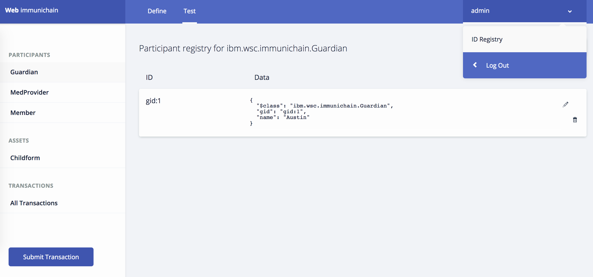

2. If you did that successfully your screen should look like this: 

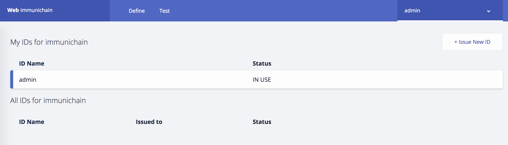

3. Now, **click on + Issue New ID.** A pop-up will come to the top and ask for an ID Name and Participant

4. Now, try creating a new identity (outside of Composer, I wouldn’t recommend trying to create a new identity) with the name of HealthQuest. For the participant just **type in the number 1 or the ID Number you gave your participants** and see what pops down.

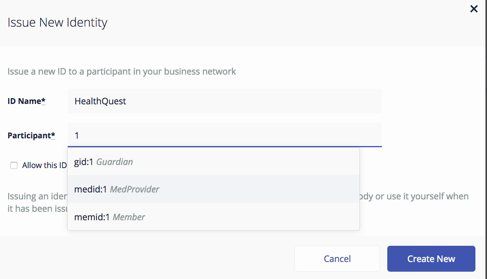

5. Click on **Create New** and you have now created a new identity

6. Then another pop-up will appear. For the most part, you can ignore the top portion of that pop-up. As far as the bottom part, click on **+Add to my Wallet**

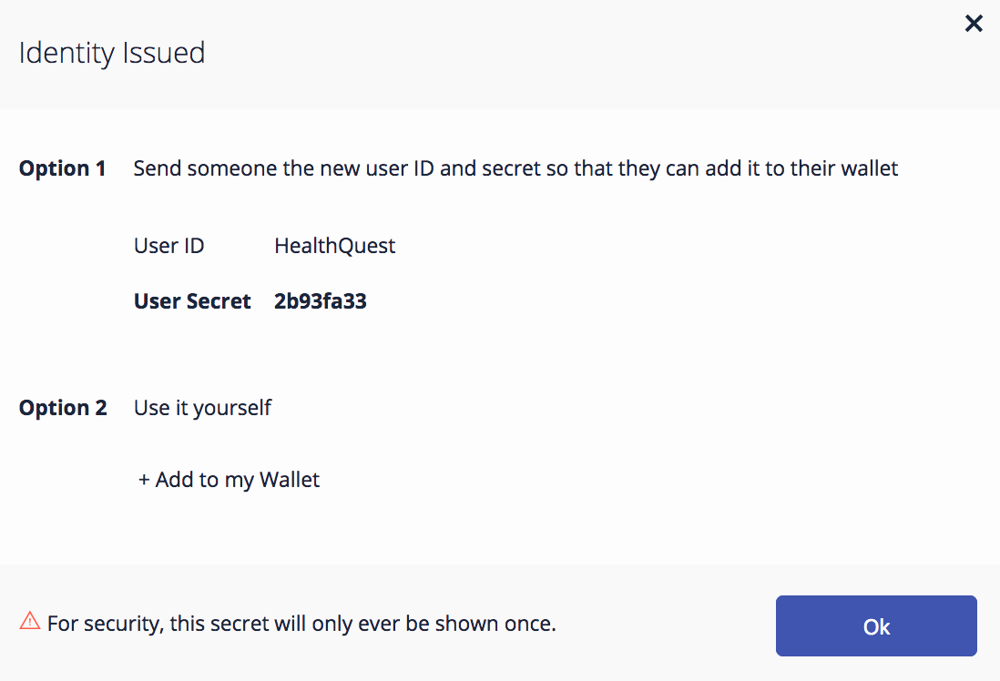

7. Once you have done that, this is what your screen will look like: 

.. image:: Images/152.png

8. **Create Identities for all of your participants** 

9. Once you have done that your screen will look like this:

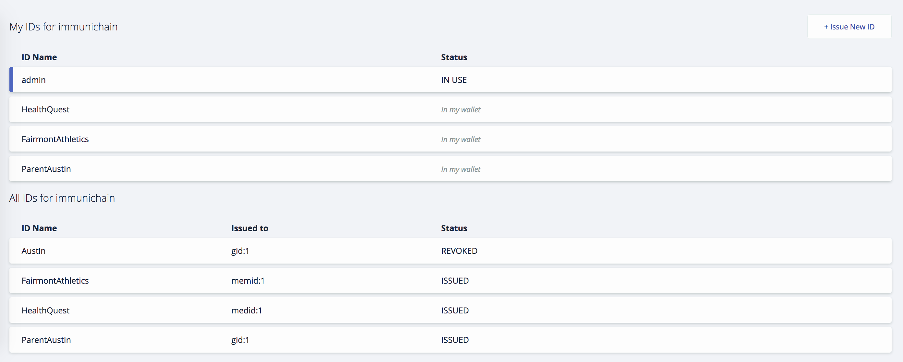

How many of you tried to create an identity of the child? Why do you think you were unable to create an identity for your child? 

One thing is that we have the Child as an asset and not a participant in the model file in Composer. More importantly, you wouldn’t want to have your child have access to change vital information - until you give them the authorization to do so. 

10. Alright, you have created several identities. How do we actually switch to them? I’m glad you asked. **Click on admin in the top right and then click on Log Out**

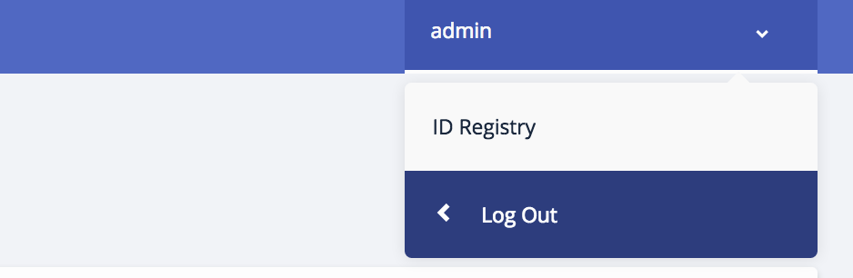

11. Now your screen will be filled with identities that you can connect to. 

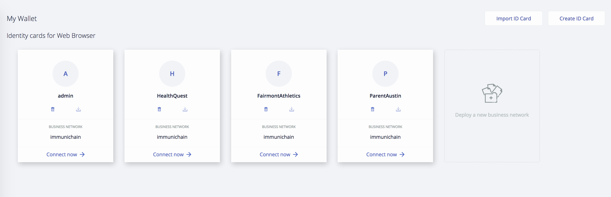

12. Try connecting to your various identities. Once you connect jump over to the Test section of Composer. Notice how the top right is now the name you gave your identity. 

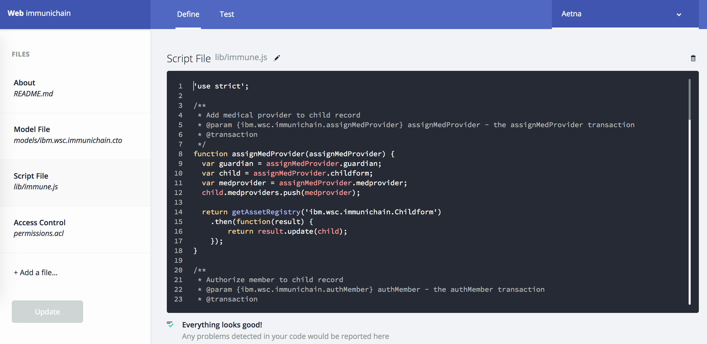

13. **Try creating a Member in the Test section of Composer**

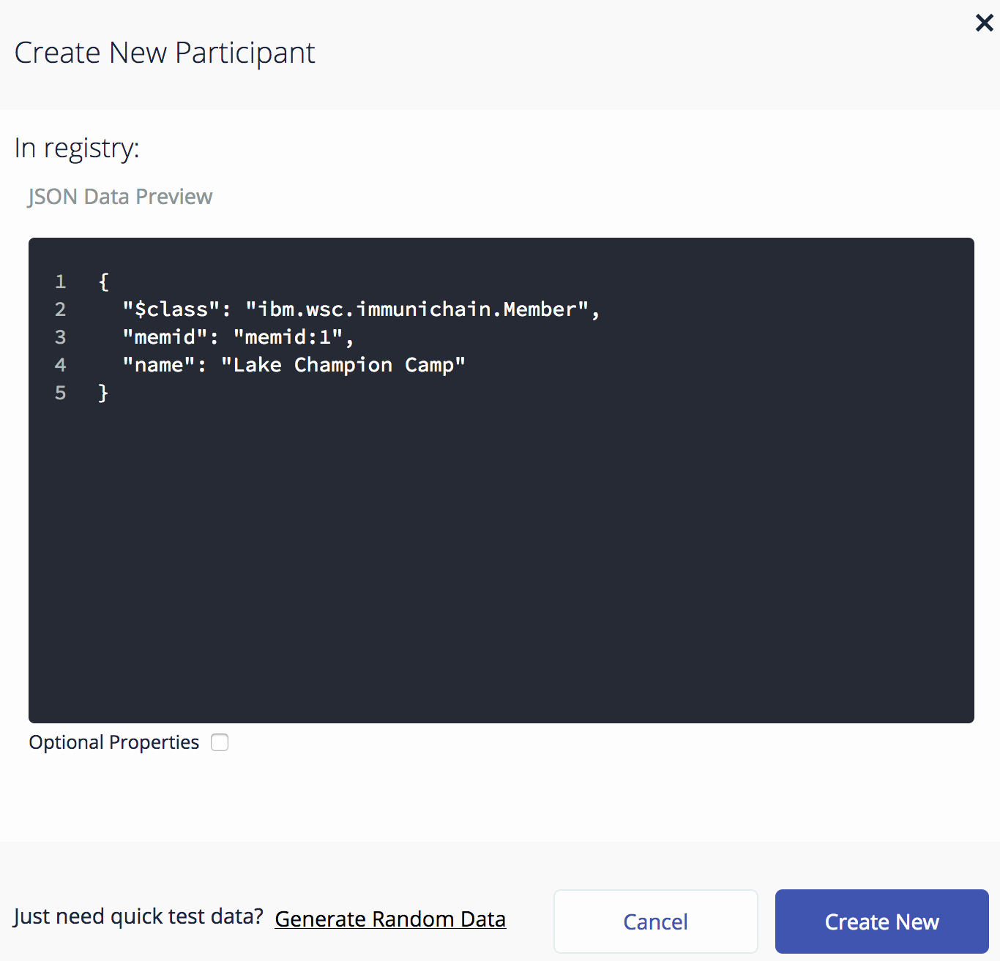

Why do you think you couldn’t successfully create a member? When designing this network, this type of authorization was what was agreed upon. In a real situation, you would discuss who can do what between all participants.

14. Jump back over to the admin identity. There we have authorization to create participants and submit transactions. 

**What did you just accomplish?**

You created various identities for the participants you have created in Composer. Then you created additional participants from those identities. For a good reason, you learned why you couldn’t do that.

Part 6: Submitting Transactions
===============================

1. Make sure you are connected back to the admin identity. You know by noticing the name in the top right of the screen. 

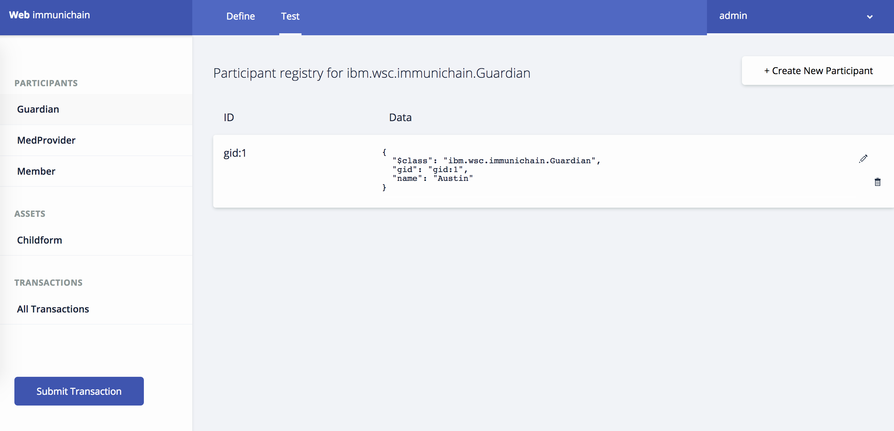

2. **Click on Submit Transaction**

3. A pop-up will appear with the transaction of assign a Medical Provider to one the children you’ve created

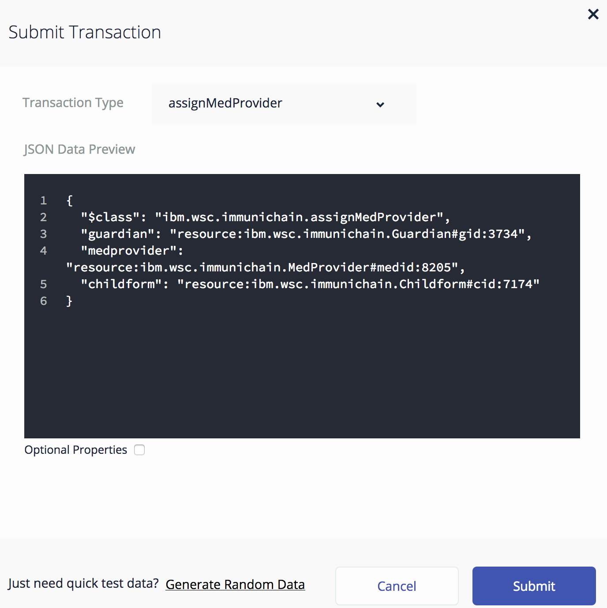

4. Now, **replace the ID Numbers to replicate the guardian, medical provider and child.** Look at the picture below to get a sense of what to do.

That basically says, assign medical provider #1 (HealthQuest) to Child #1 (SJ).

5. **Click Submit** once you have the ID Numbers you want.

6. Once you submit the transaction, it will take you to the Historian. Now is a good time to tell you about the Historian. The Historian is the sequence of transactions or addition or removal of participants or assets. I didn’t tell you to look at the Historian when you were creating the Participants, but the Historian kept track of when and what type of participant or asset you created. You can scroll to the bottom to view the first transaction you created, which should be the Medical Provider, HealthQuest or whatever you called it. You can see by clicking on view record. 

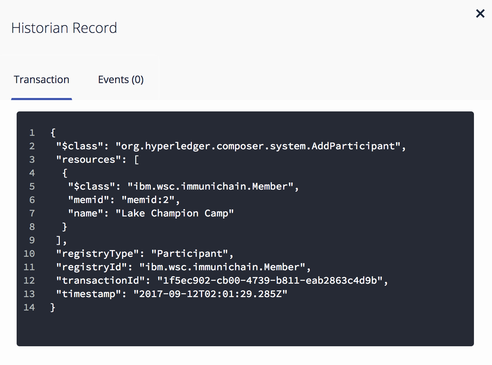

7. Back to our transaction, **click on the Childform on the left.** Find the child you assigned a Medical Provider to. **Click on Show All to view the entire asset of that child.** Notice the medical provider you assigned it to? 

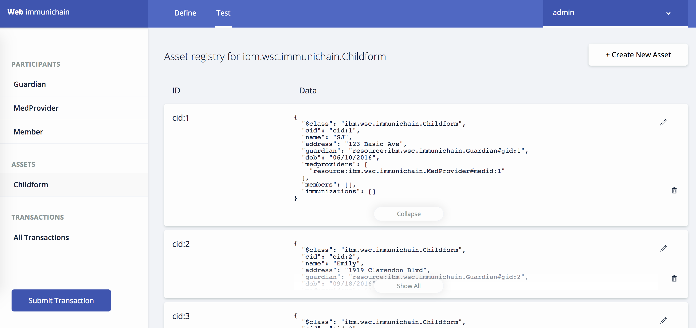

8. Should we do another transaction? Of course! **Click on Submit Transaction** and let’s authorize a member to view the health record of our child. **You can change the type of transaction** you want by click on the middle grey box.

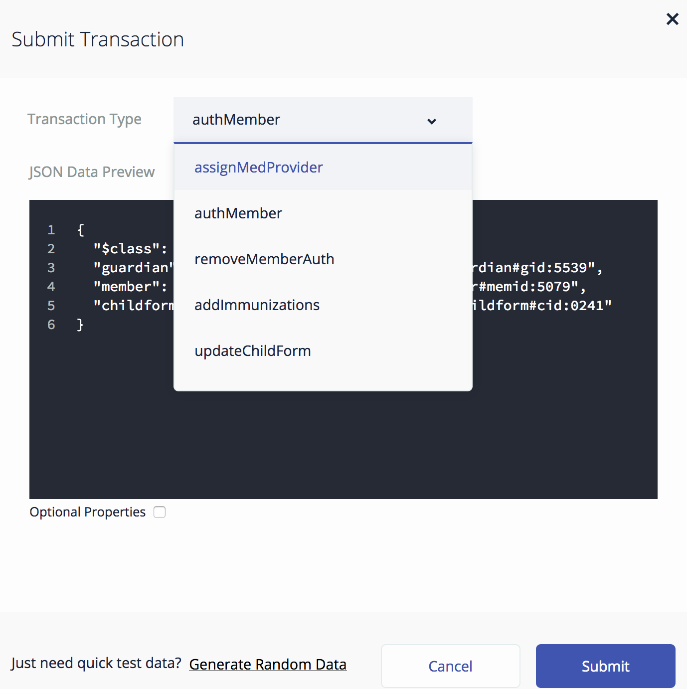

9. Now, let’s make an authorized member transaction. Here is my transaction

My transaction says let member #1 (Fairmont High School Athletics) have Child #2’s (Emily) health record. This would be extremely useful when every year millions of kids get physicals in order to play a sport. Imagine having your medical provider authorize your child’s health record to approve them playing a sport. I know my parents would've enjoyed not dealing with both the High School and the Medical Provider.

10. You can view this transaction by clicking on childform on the right and then Show All on Emily. Notice that member #1 is now in Emily’s description. 

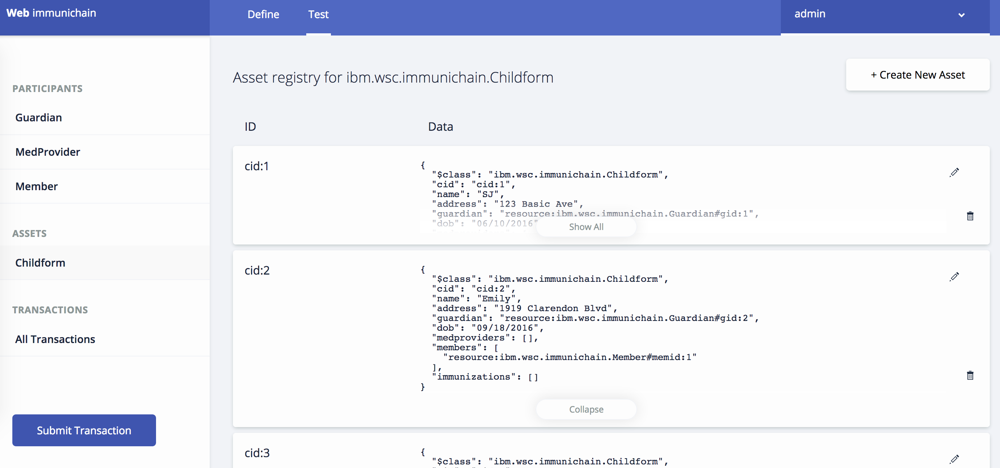

11. Let’s do another transaction. This time, l**et’s remove an authorized member that we just gave to Emily.** Here is what my transaction looks like: 

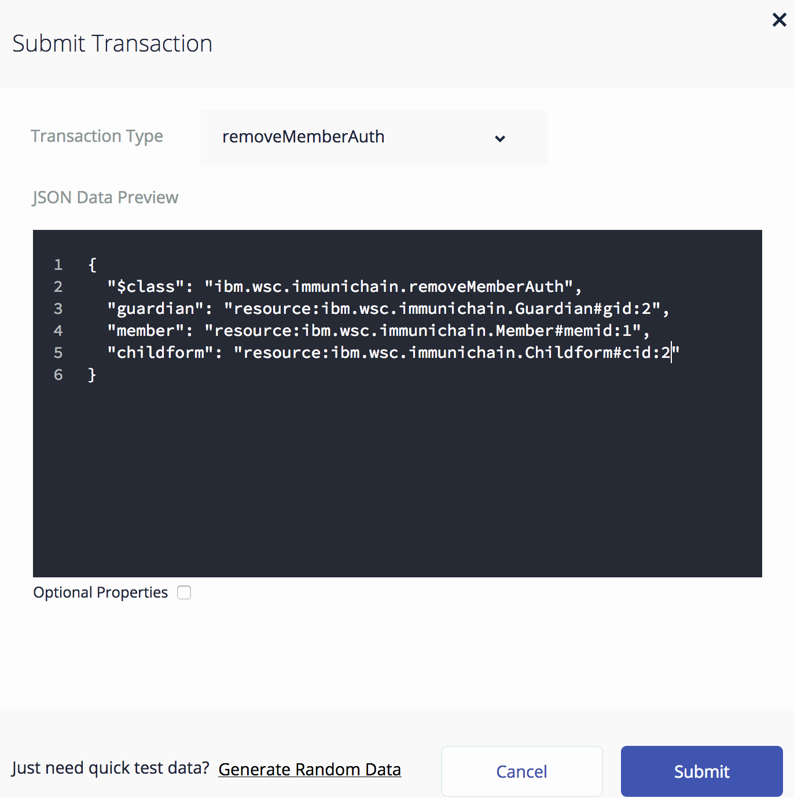

12. Emily in the Childform section should look like this: 

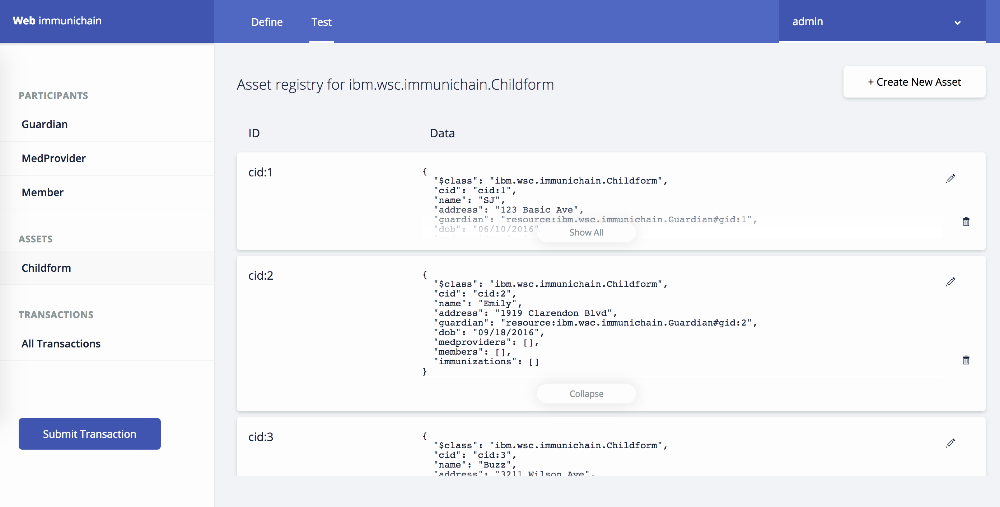

13. We have submitted transactions, but now let’s actually add some immunizations to a child.

14. **Click on Submit Transaction** and then change the transaction type to **addImmunizations.** The format to add an immunization is a little different. In the Vaccine section put **{ "name" : "immunization", "provider" : "medical provider", "imdate" : "date" }** inbetween the brackets []. **Replace the immunization, medical provider and date with whatever you would like.** Here is what my transaction looks like: 

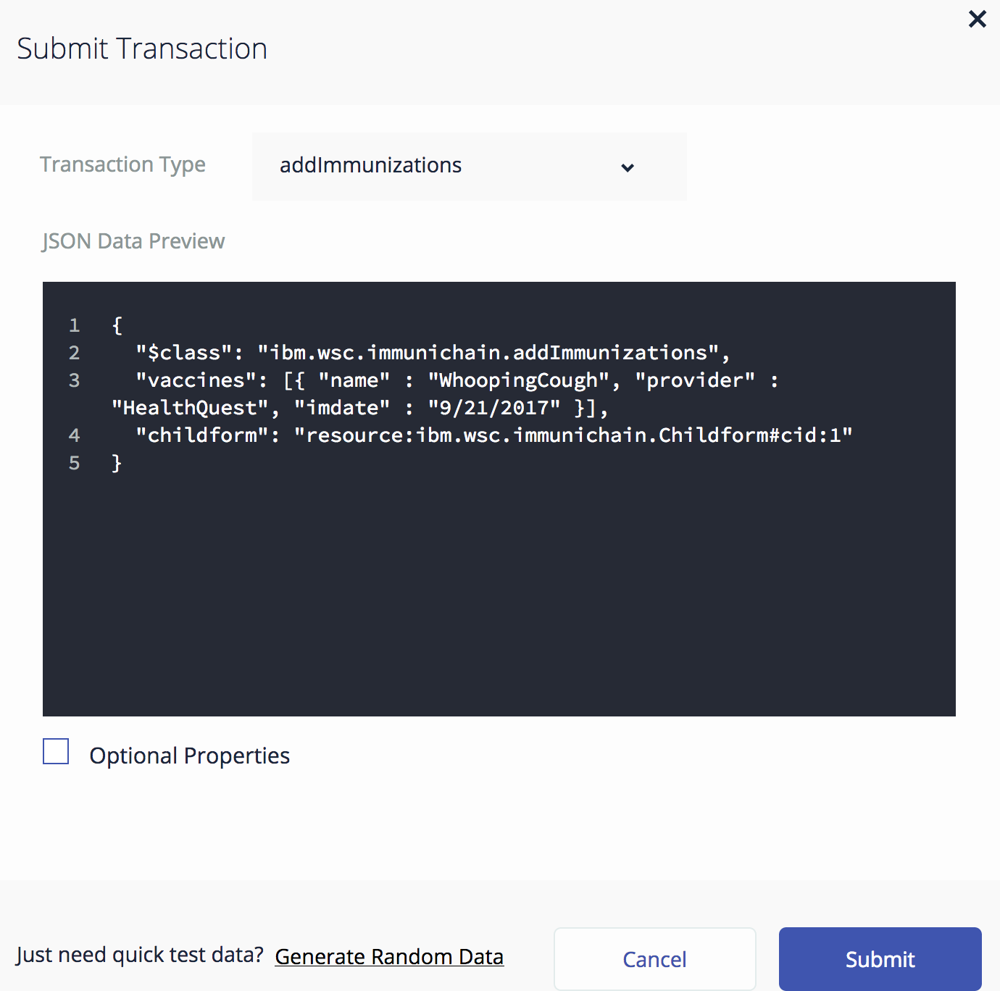

15. To view your immunization, go your child in the Childform section.

.. image:: Images/106.png

16. Continue to make various transactions that you want. 

**What did you just accomplish?**

You submitted transactions against participants within Composer. Hopefully, you now understand the value of authorizing members. Also, you added Immunizations to your child, which is the a pillar of Immunichain.

Part 7: Production Immunichain
==============================

1. Open up Google Chrome. Immunichain doesn’t work too well in Firefox. It does work in Firefox, but Google Chrome works the best. 

2. **Go to https://immunichain.zcloud.marist.edu** - Your screen should look like this: 

.. image:: Images/60.png

3. **Click on Create an Account**

4. Enter the required information you need in order to create an account. **I would write down your username and password. We will only create a Healthcare Provider this time**

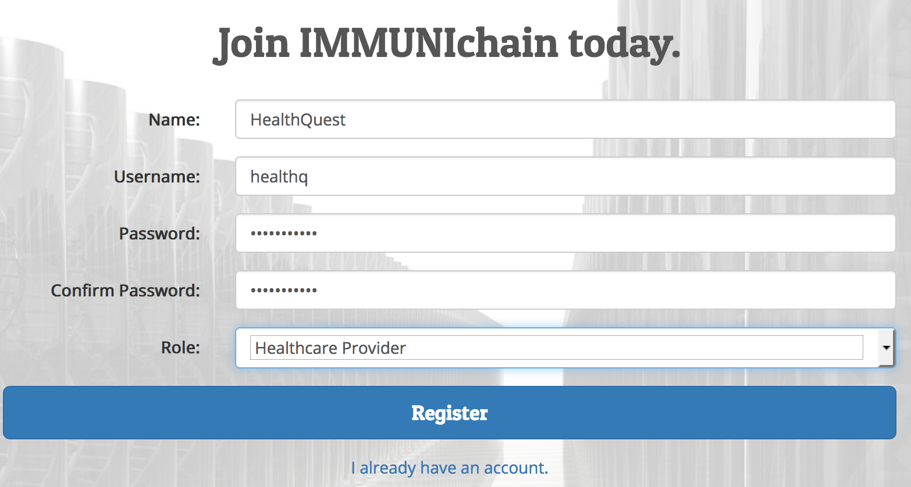

5. Your screen should look like this: 

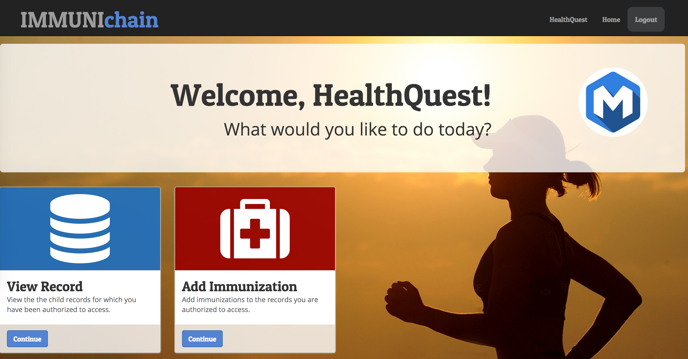

6. Log out of your participant by **clicking on Logout button** in the top right

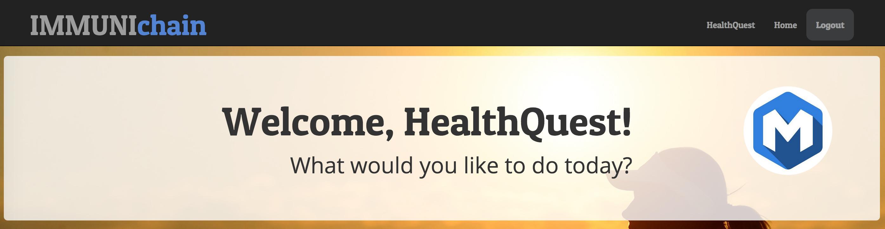

7. **Create another account, but this time do a Member Organization**


8. My screen looks like this. Notice how this member is only allowed to view the health record of the child? Why do you think that is so?


9. Log out of that participant. **Create a few more Healthcare Providers and Member Organizations**

10. Once you have a few more participants, let’s **create a Guardian now** 

11. Adding a Guardian is similar to adding Member Organizations or Healthcare Providers. After creating a Guardian, this is what my screen looks like: 


12. Here we will **Add a Child.** This is found at the bottom of the page 


13. Now fill in the information required. Go ahead and assign Healthcare Providers and Member Organizations to your child. Because there are a lot of people doing this lab, there will be a lot of various Healthcare Providers and Member Organizations to choose from. Only select the Healthcare Providers and Member Organizations that you have personally created. **Click on Submit when you are done**


14. If you get the Success! page, **click on Logout** in the top right 


15. Once you are on the homepage, **log into the Healthcare provider** you assign to your child

16. Once you are in the home page of the Healthcare Provider, click on **Continue of Add Immunization**

17. **Select the child in the drop down**


18. Then **add an immunization and the date you added the immunization.** Once you have added the information you want, **click on Submit** 


19. You will get the Success! page once again. **Logout and log in as the Member Organization you assigned to your child** 


20. Then **click on Continue of the View Record** 

21. Now, **click on the child you created**


22. This is the view that this member has on your child. The Member cannot edit the information. They can only view the health record that they have authorization to. 


23. Continue to make various accounts and updating your children that you create. 

**What did you just accomplish?**

You went to the Immunichain website and create various accounts. You added Member Organizations, Healthcare Providers, Guardians and Children. Then you then added immunizations from the Healthcare Provider account to the child. Then you viewed the health record of the Child from the Member's perspective. 
  

Part 8: Connecting Composer to a Fabric
=======================================

First, you can only do this if you are on a LinuxOne Community Cloud instance or on a local machine. You cannot do this from the Cloud Hyperledger Composer Playground. 

1. From the admin view in Composer, **click on Log Out in the top right**


2. Then **click on Create ID Card** in the top right


3. Select the **Hyperledger Fabric v1.0 option and click on Next**


4. **Create the Profile Name** you want and add a description you want 


5. Scroll to the bottom and change the **Key Value Directory Path to /home/linux1 and click on Save**

.. image:: Images/80.png

6. You will then be sent to another screen. The **Enrollment ID will be admin and the Enrollment Secret will be adminpw.** Then give your Business Network a name. Make sure you observe whether you use upper case or lower case. The **click on Create** 


7. You will be then taken back to your Wallet page. Notice how there is now a card at the bottom. That is what you just created 

8. Scroll down and then **click on Connect Now.** Notice how you receive an error? Why do you think that is so? We have more work to do before it will work. 


9. Now open your terminal change directories where you immunichain.bna file is stored on your local machine. Do a secure copy of the immunichain.bna file. **scp immunichain.bna linux1@xxx.xxx.x.xxx:~/**

Replace the xxx.xxx.x.xxx with you LinuxONE CC IP Address.


10. Now, **log into your LinuxONE CC instance**

11. Enter this command to connect your command line to the fabric you just created in step 6. **composer network deploy -a immunichain.bna -p hlfv1 -i PeerAdmin -s anything** - This connects the playground Fabric to actually having a Fabric in your command line. If you see, Command Succeeded, that’s a very good sign.


13. Now go back to the Composer Playground and try Connect Now this time around. 


12. Now run **composer network list -n immunichain -p hlfv1 -i admin -s adminpw** to see all the participants and assets you have created. 


**What did you just accomplish?**

You exported your Composer Playground and connected it to a Hyperledger Fabric. Then you deployed the Fabric. Then you ran a command to find out the amount and which participants you have. 

Part 9: Connecting Your Immunichain Fabric to a REST Server
===========================================================

1. In your terminal do **which composer-rest-server**

2. Then enter **composer-rest-server -p immunichain -n immunichain -i admin -s adminpw -N always**


3. Then go your web browser and enter your **xxx.xxx.x.xxx:3000/explorer.** Replace the xxx.xxx.x.xxx with your IP Address.


4. Then go click on **ibm_wsc_immunichain_MedProvider**


5. Select **POST and click on the light brown box in the bottom right.** That will place that code in the white box in the bottom left 


6. Make appropriate changes that you see in the picture below.


7. **Click on Try it out!**

8. Scroll down and look at the response code. **If you get Response Code: 200 that is very good.** That means it was added as a Medical Provider.


9.  To test this out scroll back up and **click on GET**

10. **Once GET has loaded, click on Try it out!** Scroll down and you will now see HealthQuest as a Medical Provider.


11. Let’s try adding a Member. Click on **ibm_wsc_immunichain_Member and then POST**

12. Change the syntax to replicate what is in the picture below and then click on **Try it out!**


13. Scroll back up to **GET within the Member and click on Try it out!**

14. Now, you should receive a very similar message as to what is below


15. Go ahead and add a few other participants and assets through the REST server. I don’t recommend working with the transactions, but rather stick to Participants and Assets. If you are confused on what the expected syntax is, go back into the Composer Playground and add a participant. Then go back into the REST server with the correct expected syntax. 

**What did you just accomplish?**

You started the Composure REST server that makes up the Immunichain Network. Then you added a few participants and assets from the REST server and tested it to verify that it successfully worked. 

End of Lab!
===========
